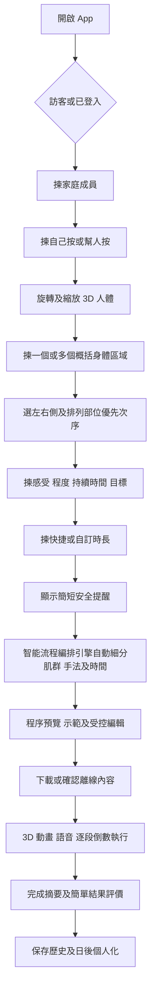

# Massage Flow — Product Specification

| 文件欄位 | 內容 |
|---|---|
| 文件狀態 | 已確認產品方向；已納入 MVP「智能流程編排 v1」、模式可觸及性、多部位、感受目標及受控編輯 Prototype 更新 |
| 版本 | 1.5 |
| 日期 | 2026-08-17 |
| 作者 | Manus AI |
| Working title | Massage Flow，可於開工前全域更名 |
| 目標平台 | iOS／Android 手機 App；預留網頁版及內容管理後台 |
| MVP 語言 | 繁體中文介面、廣東話語音 |

> **v1.5 Prototype 受控編輯：** 用戶可在程序預覽中重排概括部位優先次序、每次以 30 秒調整主要段落時長，並把 `SUBSTITUTE_ONLY` 段落改成較柔和的已審核替代動作。系統必須保留總時長、暖身與收尾，並以重新驗證後的同一份方案進入示範與倒數。

## 1. 產品摘要

**Massage Flow** 係一款畀非專業成人使用嘅按摩流程設計及引導 App。用戶可以為自己、伴侶或成年家人建立檔案，透過可旋轉、縮放嘅 3D 人體模型揀選概括身體區域，例如肩頸、上背、中背、下背或小腿；再選擇優先次序、當前感受、按摩目標同可用時間。用戶毋須先認識或手動點選肌肉，系統會按已審核規則自動細分相關肌群、手法、力度、時長及次序，生成一套由準備、主要按摩到放鬆收尾嘅徒手按摩流程。

生成後，用戶唔需要由空白開始設計。系統會先以「程序預覽及示範」清楚展示每個細分階段，再容許用戶受控調整部位次序、每步時間、力度偏好同替代手法。用戶確認後，執行期間嘅 3D 人體會逐步高亮實際位置、顯示肌肉名稱、手部擺位、按壓方向同力度；倒數、動畫、文字及廣東話語音會同步播放。

> **產品定位：** Massage Flow 係一般放鬆、自我照顧同家庭按摩指引工具，唔係醫療診斷、治療、復康或專業按摩培訓產品。

## 2. 產品願景與價值

一般人往往只知道「肩膊緊」、「小腿攰」或者「想幫伴侶放鬆」，但未必知道涉及邊一塊肌肉、應該由邊度開始、每個部位做幾耐，以及點樣安排一套完整流程。Massage Flow 將抽象嘅身體感受轉化成可視化、可跟隨、可重播嘅按摩步驟，降低非專業用戶由需求去到行動之間嘅門檻。

| 核心價值 | 產品表現 |
|---|---|
| 容易指出位置 | 以互動 3D 人體取代專業解剖術語作為入口；用戶先揀概括區域，系統後續自動細分相關肌群。 |
| 唔使由零編排 | 系統按時間、概括部位同優先度生成細分程序，用戶只需預覽、觀看示範及作有限調整。 |
| 清楚知道點做 | 每一步都有位置、肌肉名稱、姿勢、手法、方向、力度、時間同語音提示。 |
| 適合自己或家人 | 同一個產品支援自我按摩同替他人按摩，並自動改變視角同可用動作。 |
| 可以重複改善 | 保存完成紀錄同簡單結果評價，日後以可解釋方式微調方案。 |

## 3. 目標用戶與使用邊界

MVP 只服務 **18 歲或以上成人**。核心用戶唔需要有解剖學、物理治療或專業按摩知識，但需要有能力理解螢幕提示、控制力度及自行決定係咪適合進行一般放鬆按摩。

| 用戶類型 | 典型情境 | 主要需要 |
|---|---|---|
| 自我按摩用戶 | 放工後肩膊繃緊，想用 10 分鐘做一套可自行觸及嘅流程。 | 鏡像／第一身視角、可觸及位置、簡單手法同免手持語音。 |
| 伴侶按摩用戶 | 想幫伴侶按肩背，但唔知道肌肉名稱、次序同時間。 | 按摩者視角、清楚手部位置、姿勢安排、方向動畫同倒數。 |
| 家庭照顧用戶 | 為成年家人保存常用部位、力度偏好同過往方案。 | 多成員檔案、歷史紀錄、快速重做同可解釋個人化。 |

以下情境唔屬於 MVP：未成年人、專業按摩師工作流程、醫療診斷、受傷評估、疾病治療、復康計劃、脊椎推整、關節復位、按摩工具教學，以及急性或高風險身體狀況嘅個別判斷。

## 4. 產品目標與非目標

| 類別 | 定義 |
|---|---|
| 主要目標 | 令成人非專業用戶可以由「指出想按嘅位置」開始，完成一套有結構、有時間限制、可視化及可聽取指引嘅徒手按摩流程。 |
| 主要目標 | 令自我按摩同替他人按摩都可以使用同一套內容架構，但按可觸及範圍、姿勢同觀看角度調整。 |
| 主要目標 | 以經審核動作庫同決定性規則生成方案，令相同輸入可以重現相同核心結果。 |
| 非目標 | 唔判斷痛楚成因，唔提供疾病或受傷診斷，亦唔聲稱可以治療任何病症。 |
| 非目標 | 唔容許 AI 自行創作按摩手法、肌肉位置、安全規則或醫療建議。 |
| 非目標 | MVP 唔支援按摩球、泡沫軸、按摩棒、按摩槍或其他工具。 |

## 5. 產品設計原則

| 原則 | 說明 |
|---|---|
| 概括選區先於肌肉術語 | 用戶只需喺身體表面指出例如上背、中背或下背等概括位置；相關肌群會由系統編排後展示。 |
| 預設先於空白 | 非專業用戶先收到完整細分程序及示範，再作受控調整。 |
| 顯示先於描述 | 重要位置、方向同姿勢要以 3D 高亮、箭嘴或動畫表達，文字只作補充。 |
| 低操作負擔 | 按摩期間以自動倒數及語音為主，唔要求用戶不斷觸控螢幕。 |
| 內容安全優先 | 就算產品唔做個人健康篩查，動作庫本身仍然唔可以包含高風險技巧或禁按位置。 |
| 歷史可重現 | 方案要保存當時步驟及內容版本快照，避免日後更新令舊紀錄改變。 |
| 個人化可解釋 | 任何按過往結果作出嘅調整，都要講明原因，並容許關閉或重設。 |

## 6. 端到端用戶流程

## 7. 詳細功能要求

### 7.1 首次使用與安全聲明

首次使用時，App 要以完整版本說明產品只供一般放鬆及自我照顧使用，唔代替醫護或專業人士判斷。NCCIH 指出按摩整體傷害風險一般較低，但曾有罕見而嚴重嘅血栓、神經損傷或骨折報告，較大力度按摩及較高風險人士需要更小心；同時亦唔應以按摩延誤就醫。[1] 因此，完整聲明需要清楚列出停止使用及尋求專業協助嘅一般原則。

用戶確認一次完整聲明後，其後每次開始前只顯示一行簡短提醒。按照已確認產品決定，MVP **唔提供個人健康問卷、風險分類或強制阻擋**；系統只透過內容限制、禁按區及文字提醒降低風險。

### 7.2 訪客模式、帳戶與家庭成員

MVP 以訪客及本機資料為主。用戶可以建立「我」、「伴侶」或其他成年家人檔案，資料包括暱稱、18 歲以上確認、年齡段、預設模式、力度偏好及可選備註。性別唔係必填資料；3D 人體外觀亦要同健康或安全判斷分開。

V1.1 加入登入後，訪客資料可以合併到雲端帳戶，以支援備份、跨裝置同步同資料恢復。用戶要可以匯出或刪除自己同家庭成員資料。

### 7.3 模式選擇

每次開始要明確揀「自己按」或「幫人按」。呢個決定會影響可觸及部位、姿勢、3D 觀看角度、左右方向、手部擺位及可用動作。

| 模式 | 預設行為 |
|---|---|
| 自己按 | 使用鏡像／第一身角度，只提供一般人可自行觸及及控制嘅動作。 |
| 幫人按 | 使用按摩者視角，按接受按摩者嘅坐姿、仰臥、俯臥或側臥顯示位置。 |

#### 7.3.1 模式化可觸及性與替代規則

模式唔可以只改文案或相機角度。用戶選擇「自己按」後，選區層必須只顯示可由本人一般姿勢直接觸及、可控制力度、且已有已審核自我按摩動作嘅概括區域；難以自行接觸嘅位置唔可當作一般可選 target。若同一概括區域有可行替代，介面要顯示「自己較難直接按到」及替代方向，編排引擎只可採用已審核替代動作。

用戶選擇「幫人按」後，系統才可開放需要按摩者站位、接受者姿勢或背面接觸嘅完整區域與動作。兩種模式都仍受永久禁按區、禁止技巧、保守力度及內容版本限制；替代規則唔可以用嚟繞過安全限制。

### 7.4 3D 概括身體區域選擇

3D 人體係核心入口。用戶可以旋轉、縮放、重設視角、切換前後面，以及喺「皮膚表面」同「肌肉透視」之間切換。MVP 選擇層只要求用戶揀肩頸、上背、中背、下背、小腿等**概括身體區域**，毋須喺輸入階段手動選擇肌肉。系統必須先按目前模式套用 `DIRECT`、`SUBSTITUTE_ONLY` 或 `UNAVAILABLE` 可觸及性狀態：自己按只可選 `DIRECT`，`SUBSTITUTE_ONLY` 只可經清楚替代提示加入方案，`UNAVAILABLE` 不可選；幫人按則可使用已審核的完整動作集合。系統可以喺肌肉透視層顯示相關肌群作教育性提示，但該畫面不要求用戶逐一點選或理解肌肉名稱。

一次按摩可以揀多個部位。每個部位要支援左側、右側或雙側，並由用戶排列優先次序。智能流程編排引擎會在生成階段按已發佈 `region_muscle_map` 自動展開相關肌群，再配對已審核動作。3D 模型要持續顯示已選概括區域、優先標籤、禁按區及目前仍未完成嘅輸入。

#### 7.4.1 多部位 Prototype 驗證範圍

目前 Prototype 開放 **肩／上背、中背及下背** 三個概括部位。用戶先選一個或多個部位、以清單調整處理優先次序，再逐一確認左側、右側或雙側；規則引擎會保留一組暖身及收尾，並把主要時長按優先次序分配。每個部位在自己按與幫人按模式下都要產生不同的細分動作集合；自己按的難觸及位置必須使用明示的替代動作，不能靜默保留原動作。

### 7.5 感受、程度、持續時間與目標

每個目標部位採用固定快捷選項，並容許可選補充。固定選項至少包括繃緊、酸攰、僵硬、壓痛感同純粹想放鬆；程度使用 1–5 級；持續時間使用今日開始、幾日、長期反覆等區間；目標包括一般放鬆、活動前準備、活動後恢復、改善活動感同睡前舒緩。

完整產品願景包括可選文字及語音補充。MVP 可以保存文字備註，但規則引擎只使用固定選項；語音轉寫及 AI 理解延後至 V1.2，避免用戶誤以為未處理嘅自由文字已影響方案。

#### 7.5.1 感受及目標 Prototype 驗證範圍

目前 Prototype 在完成每個概括部位左右側設定後，先收集一組適用於今次流程嘅感受、程度、持續時間及目標，再讓用戶揀總時長。固定選項包括繃緊、酸攰、僵硬、壓痛感、純粹想放鬆；程度為 1–5；持續時間為今日開始、幾日、長期反覆；目標為一般放鬆、活動前準備、活動後恢復、改善活動感、睡前舒緩。

這組輸入唔只作記錄：目標會改變暖身與收尾預算；程度 4／5 或 5／5 會增加暖身及收尾時間，令主要按摩時段相對縮短並以較保守節奏顯示。部位優先次序仍由用戶排列，預覽必須解釋今次感受、目標與時間分配點樣影響方案。現行 Prototype 暫時以一組 session-level 輸入套用至全部已選部位；每個 target 各自填寫嘅 accordion 表單保留為 MVP 後續擴充。

### 7.6 時長選擇及時間分配

App 提供 `5、10、15、20、30 分鐘`快捷選項，同時容許自訂。系統要根據部位數量、優先度、必要準備及收尾時間，顯示建議最短時間。用戶仍可選擇較短時間，但系統要講明方案會集中處理最高優先部位。

時間分配唔採用平均分配。規則引擎要按部位優先度、左右側數量、模式可觸及程度、動作最短時間同姿勢轉換成本分配；時間不足時，先保留最高優先部位、必要熱身及收尾。

### 7.7 智能流程編排 v1

「智能流程編排 v1」係 MVP 核心功能，唔係單純倒數計時器。每套方案固定分為「準備／熱身」、「主要按摩」同「放鬆收尾」，並由多個可執行 `Program Segment` 組成。每個 segment 都包含概括部位、細分肌群、姿勢、手法、力度、時長、示範資產及下一步提示。方案只能由經審核動作庫組合，唔可以臨時生成新手法。生成時要同時處理以下約束：

| 約束 | 產品行為 |
|---|---|
| 自己按／幫人按 | 過濾唔適合該模式嘅動作同視角。 |
| 可觸及性與替代 | 先按模式過濾 `UNAVAILABLE` target；只可對 `SUBSTITUTE_ONLY` 使用已發佈、可解釋嘅替代動作及提示。 |
| 概括部位及自動肌群細分 | 根據用戶所選區域，以已發佈肌群對應及規則自動選擇相關肌群與動作；用戶毋須在輸入階段手動點肌肉。 |
| 優先次序及時間 | 先滿足高優先部位，再分配剩餘時間。 |
| 姿勢 | 將同一坐姿、仰臥、俯臥或側臥步驟分組，減少轉位。 |
| 內容安全 | 排除禁按位置、高風險技巧及唔適合非專業成人嘅動作。 |
| 離線可用性 | 只使用裝置已下載，或可喺開始前完整下載嘅資產。 |

### 7.8 程序預覽、示範及受控編輯

在正式倒數開始前，預覽頁以時間軸及姿勢分組顯示已編排好嘅全部流程卡。每張卡要展示階段、用戶所選概括部位、系統安排嘅細分肌群、姿勢、手法、力度、時間及需要嘅 3D／語音資產。預覽頁必須以縮圖、動畫片段或進入全螢幕 3D 預覽嘅方式，讓用戶**示範式地理解**系統會點樣安排，而唔只顯示剩餘時間。

用戶可以改概括部位次序、每段時間、力度偏好、跳過非必要 segment，或者揀系統提供嘅安全替代手法。系統每次修改後都要重新計算肌群安排、總時間及姿勢排序；必要準備及收尾唔可以完全移除。MVP 唔提供由空白建立新動作、輸入自訂手法或任意改寫肌群安全規則。

### 7.9 3D 執行引導播放器

執行畫面以全螢幕 3D 人體為主。每一步至少要同步提供以下資料：

| 指引元素 | 要求 |
|---|---|
| 位置 | 高亮準確身體區域及肌肉，清楚顯示左／右側。 |
| 名稱 | 顯示通俗部位名稱及對應肌肉名稱。 |
| 手部擺位 | 顯示用手掌、手指或指腹嘅接觸位置。 |
| 動作 | 以動畫、路徑或箭嘴顯示按壓、推移或揉動方向。 |
| 力度 | 使用易明嘅低／中等強度提示，唔鼓勵追求痛感或極大力度。 |
| 時間 | 顯示步驟倒數、剩餘總時間及下一步預告。 |
| 語音 | 廣東話講解姿勢、位置、方向、力度、時間同轉位提示。 |

播放器讀取已確認嘅 `Program Segment`，採用逐段自動倒數及自動推進，而唔只顯示全程剩餘時間。每次切換都要清楚呈現「而家按邊個細分肌群、用咩手法、仲有幾耐、下一步係乜」，並保留暫停、重播、上一步、下一步同結束。系統唔收集「太輕／太強／位置唔啱」等執行中回應；按摩者自行觀察及調整。轉換姿勢前要暫停主倒數，顯示簡單擺位圖及語音提示，待用戶確認後再開始下一組。

### 7.10 完成、歷史與結果評價

完成頁保存日期、按摩對象、模式、目標部位、原定及實際時長、方案版本、已完成及跳過步驟。用戶只需要回答一個簡單結果問題：「舒服咗／差唔多／更唔舒服」，亦可以選擇保存為常用方案。

歷史頁支援按家庭成員、部位及日期篩選，並提供「重做上次方案」。舊方案要使用當時保存嘅步驟及內容版本快照，唔應因後台更新而無聲改變。

### 7.11 個人化

V1.2 會根據個別家庭成員過往部位、時長、力度偏好、完成情況同結果評價作輕量調整。所有調整要顯示原因，例如「你過去完成 10 分鐘肩背方案嘅比例較高，因此今次優先採用相近時長」。用戶可以關閉、清除或重設個人化。

個人化唔可以推斷疾病、改變永久安全限制，亦唔可以喺缺乏明確資料時自行提高力度。

## 8. 安全內容邊界

Massage Flow 雖然唔做個人健康篩查，但仍然需要一套不可由用戶關閉嘅內容限制。官方醫院資料提醒，頸前及頸部兩側近頸動脈範圍唔應作一般按摩，肩頸按壓應輕柔，亦要避免快速或大力轉動頸部。[2] 系統性回顧亦指出，嚴重事件雖然罕見，但脊椎旋轉或推整同多類嚴重不良事件反覆相關。[3]

| 永久限制 | 產品要求 |
|---|---|
| 禁按區 | 3D 人體永久標示頸前、頸兩側、明顯骨突、眼球、前喉等位置；唔提供操作步驟。 |
| 禁止技巧 | 唔包含脊椎推整、關節復位、高速旋轉、突然扭頸、強力深壓或任何要求產生關節聲響嘅技巧。 |
| 用語限制 | 唔使用「診斷、治療、矯正、治癒、復位」等醫療效果承諾。 |
| 停止提示 | 內容要提醒用戶如出現突發劇痛、頭暈、視力異常、麻痺、無力、呼吸困難或其他明顯異常，要停止並尋求合適協助。 |
| 內容審批 | 肌肉定位、手法、力度、語音稿、3D 動畫同禁按規則均要有草稿、專業覆核、發佈及回退紀錄。 |

## 9. 核心頁面與資訊架構

| 區域 | 核心頁面 |
|---|---|
| 首次使用 | 歡迎與定位、完整安全聲明、訪客／登入選擇、語言、內容下載。 |
| 日常入口 | 首頁、家庭成員管理、歷史紀錄、快速重做。 |
| 建立方案 | 對象與模式、3D 概括選區、多部位排序、感受與目標、時長、生成中。 |
| 預覽編輯 | 程序總覽、系統細分肌群與模式、示範預覽、姿勢分組、流程卡受控編輯、總時間重新分配。 |
| 執行 | 3D 引導播放器、目前細分肌群、手法、力度、逐段倒數、下一步預告、語音、播放控制、轉位提示。 |
| 完成後 | 完成摘要、結果評價、保存方案、歷史詳情。 |
| 設定 | 帳戶與同步、離線內容、個人化、語言、私隱、資料匯出／刪除、安全聲明。 |

## 10. MVP 範圍

MVP 採用**核心可用版**，目標係完整驗證「3D 揀位 → 規則生成 → 跟住引導完成」核心循環，而唔係一次過落實全部目標架構。

| MVP 必須包含 | MVP 暫不包含 |
|---|---|
| 本機訪客模式及成年家庭成員檔案 | 跨裝置登入及雲端同步 |
| 3D 人體旋轉、縮放、概括區域點選 | 完整可營運內容審批後台 |
| 多部位、左右側及優先次序 | AI 自由文字／語音理解 |
| 固定感受、程度、持續時間及目標選項 | 進階個人化模型 |
| 快捷及自訂時長、建議最短時間 | 簡體中文、英文及其他語音 |
| 本機決定性規則生成與智能流程編排 v1 | 按摩工具及專業用戶模式 |
| 程序預覽／示範及受控編輯 | 收費、訂閱及 entitlement 執行 |
| 3D 動畫、細分肌群名稱、廣東話語音及逐段倒數 | 網頁版終端用戶產品 |
| 離線播放、歷史紀錄及結果評價 | 未成年人內容 |

### 10.1 MVP 首批身體部位

MVP 首批支援肩膊／上背、後頸安全區、下背兩側、前臂／手、臀髖外側、大腿、小腿同腳。每個概括區域必須完成肌肉對應、左右側、自己按／幫人按動作、姿勢、3D 高亮、手法動畫、廣東話語音、細分編排規則及內容安全覆核，先可以標示為可發佈。

### 10.2 MVP 內部開發順序：智能流程編排 v1

此功能屬於 **MVP 內部工作序列**，不另設產品版本或獨立 roadmap phase。先完成規則及資料契約，再完成預覽／示範，最後令倒數播放器讀取確認後嘅 segment。

| MVP 子階段 | 主要交付物 | 完成條件 |
|---|---|---|
| MVP-A：編排基線 | 概括區域到肌群對應、`Program Segment` schema、時間分配及安全規則 | 同一概括部位、時長及優先度可產生可重現嘅細分流程。 |
| MVP-B：預覽與示範 | 程序總覽、segment 卡、縮圖／3D 預覽入口及受控調整 | 用戶可在倒數前理解系統安排並作有限度調整。 |
| MVP-C：逐段執行 | 播放器讀取 segment、階段倒數、目前／下一步提示及完成紀錄 | 倒數與 3D、語音、文字及完成事件對應同一 segment。 |

## 11. 功能驗收準則

| 功能 | MVP 驗收準則 |
|---|---|
| 3D 概括選區 | 用戶可以旋轉、縮放及重設視角；所有首批概括區域都可點選、取消及顯示左右側，而毋須手動選肌肉。 |
| 多部位排序 | 最少可選三個概括區域並重新排序；生成結果會反映優先次序。 |
| 智能流程編排 v1 | 相同輸入及內容版本會產生相同 `Program Segment` 次序、肌群細分、手法及時間；總時間誤差唔超過一個短過渡步驟。 |
| 程序預覽與受控編輯 | 預覽會展示系統細分安排及示範入口；改時間、次序、力度或替代手法後，肌群安排、總時間及姿勢分組會即時重新計算。 |
| 3D 引導 | 每一 segment 正確顯示位置、細分肌群名稱、手部動畫、方向、力度、階段倒數及下一步預告。 |
| 語音 | 每一步都有可關閉、可重播並與畫面同步嘅廣東話語音。 |
| 離線 | 已下載內容及方案喺飛行模式下可完整播放、記錄完成狀態，之後仍可正常同步或匯出。 |
| 歷史 | 完成紀錄可按成員、日期及部位查看；重做舊方案使用原內容版本快照。 |
| 安全內容 | 自動內容測試同人工覆核均確認冇禁按區或禁止技巧被加入方案。 |

## 12. 成功指標

| 指標 | 定義 |
|---|---|
| 首次方案建立完成率 | 開始 3D 選區後成功到達方案預覽嘅用戶比例。 |
| 建立方案所需時間 | 由選擇按摩對象到生成方案預覽嘅中位時間。 |
| 方案完成率 | 開始播放器後到達完成頁嘅方案比例。 |
| 「舒服咗」比例 | 完成後選擇「舒服咗」嘅有效評價比例；只屬主觀產品指標，唔代表醫療效果。 |
| 7／30 日再次使用率 | 首次完成方案後 7／30 日內再次開始按摩嘅用戶比例。 |
| 3D／離線穩定度 | 3D scene 成功載入率、動畫資產錯誤率、離線方案完成率同 crash-free session。 |

分析事件只可以使用匿名或假名識別碼，唔上傳自由文字、家庭成員名稱或語音原檔。商業模式仍然係 **TBD**，MVP 唔以收入作成功判斷。

## 13. 產品路線圖

| 階段 | 主要成果 |
|---|---|
| Prototype | 驗證 3D 旋轉、概括區域點選、單一部位固定示範流程、高亮及指引動畫。 |
| MVP | 本機家庭檔案、首批概括部位、**智能流程編排 v1**、程序預覽／示範、受控編輯、3D＋廣東話逐段引導、離線、歷史同結果評價。 |
| V1.1 | 登入、雲端同步、備份／恢復、正式內容審批後台。 |
| V1.2 | AI 文字／語音理解、可解釋個人化、更多內容版本工具。 |
| V1.3 | 簡中／英文、多語音、更多部位同皮膚外觀。 |
| V2 | 按摩工具、網頁版及其他進階模式；是否支援專業用戶另行研究。 |

## 14. 主要風險與緩解方向

| 風險 | 影響 | 緩解方向 |
|---|---|---|
| 3D 定位睇落準確，但實際身體差異大 | 用戶可能錯誤理解位置 | 同時顯示表面地標、肌肉名稱同相對位置；避免聲稱毫米級定位。 |
| 內容製作量被低估 | 每個部位需要模型、動畫、語音、規則及覆核 | 以部位內容包逐批發佈，建立完整內容完成定義。 |
| 用戶將產品當醫療工具 | 帶來錯誤期望及安全風險 | 清楚定位、限制用語、首次完整聲明及每次簡短提醒。 |
| 無個人安全篩查 | 高風險個案仍可能自行使用 | 保留禁按區、禁止技巧、保守力度同停止提示；將呢項決策列為需持續覆核嘅產品風險。 |
| Unity 同一般 App 整合複雜 | 記憶體、切換、build pipeline 風險 | Prototype 先驗證全螢幕 3D scene、橋接、低階裝置同 lifecycle。 |
| 自由文字令人誤會系統已理解 | 方案可能同備註不一致 | MVP 清楚標示備註只作紀錄；V1.2 先啟用 AI 理解。 |

## 15. 待決事項

| 項目 | 狀態 |
|---|---|
| 正式產品名稱及品牌識別 | TBD |
| 商業模式、免費／付費內容邊界 | TBD |
| 雲端供應商、資料地區及合規市場 | V1.1 前決定 |
| 3D 解剖模型來源、授權及可修改權 | Prototype 前決定 |
| 專業內容覆核人員資格及簽核責任 | 內容製作前決定 |
| 廣東話語音採真人錄音或 TTS | Prototype 後按品質測試決定 |
| MVP 同時公開 iOS／Android，或先內測一個平台 | 開發排期前決定 |

## References

[1]: https://www.nccih.nih.gov/health/massage-therapy-what-you-need-to-know "NCCIH — Massage Therapy: What You Need To Know"

[2]: https://www.tph.mohw.gov.tw/?aid=504&pid=0&page_name=detail&iid=153 "衛生福利部臺北醫院 — 肩頸按摩致動脈剝離？醫提醒按摩也有風險"

[3]: https://pmc.ncbi.nlm.nih.gov/articles/PMC4145795/ "Yin et al. — Adverse Events of Massage Therapy in Pain-Related Conditions: A Systematic Review"
