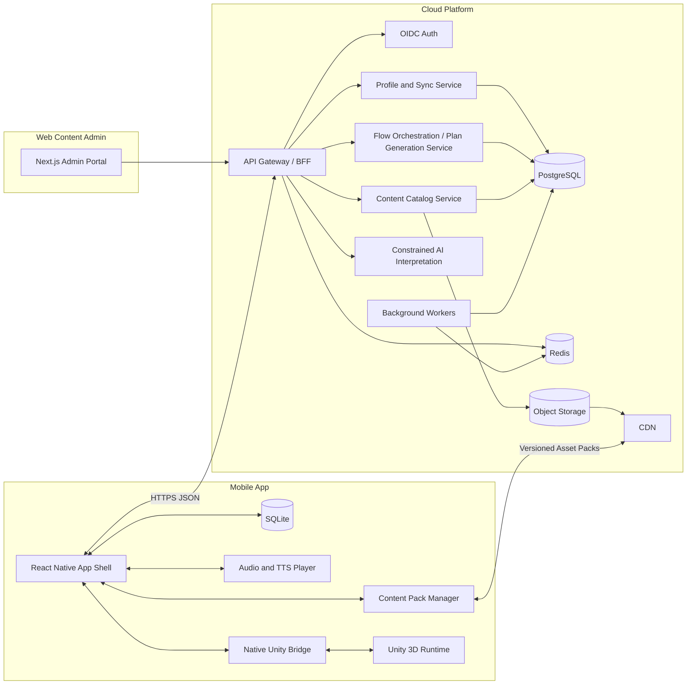
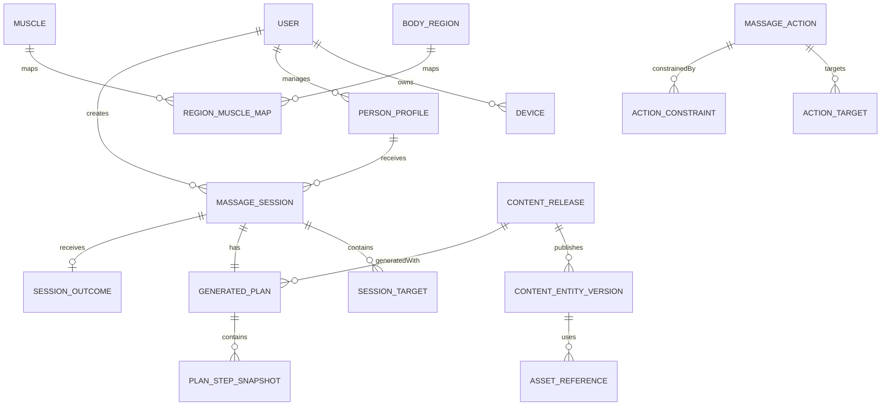
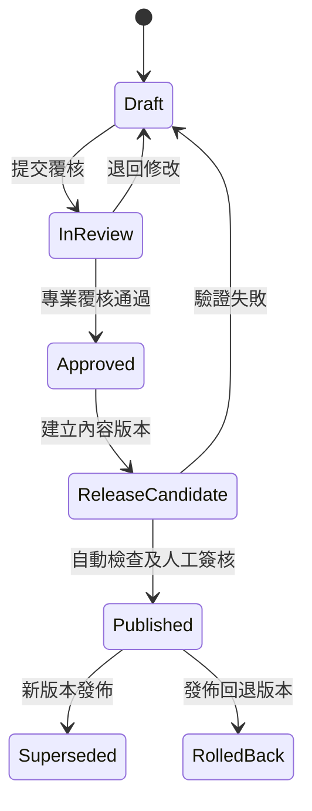

# Massage Flow — Technical Specification

| 文件欄位 | 內容 |
|---|---|
| 文件狀態 | 建議技術基線；已對照現行 Prototype 的 MVP「智能流程編排 v1」、模式可觸及性、多部位、感受目標及受控編輯規則 |
| 版本 | 1.5 |
| 日期 | 2026-08-17 |
| 作者 | Manus AI |
| 對應 Product Spec | `01_product_spec.md` v1.5 |
| 主要客戶端 | React Native + Unity full-screen module |
| 主要後端 | TypeScript API、PostgreSQL、Object Storage／CDN、Redis |

> **v1.5 Prototype 實作：** `ProgramEditIntent` 只接受 `targetOrder`、主要段落時長 override 及 `GENTLE` 替代變體。規則引擎重新分配主要時間，但不容許刪除準備／收尾、改變總時長或改用未審核技巧；預覽、示範與播放器讀取同一份重算結果。

## 1. 文件目的

本文件定義 Massage Flow 由 Prototype、MVP 到 V1.x 嘅建議技術架構、資料模型、介面合約、方案生成規則、內容治理、離線同步、安全、可觀察性、測試同部署原則。文件係日後開工、估算、拆票、技術驗證及修改設計嘅共同基線，**唔代表目前已經建立任何程式、雲端資源或 3D 資產**。

技術方案優先滿足三個核心條件：第一，用戶可由概括 3D 身體區域完成選擇，而毋須先認識肌肉；第二，智能流程編排引擎只可以由經審核動作庫及決定性規則產生細分 `Program Segment`，再交由預覽及播放器消費；第三，內容、用戶紀錄同大型媒體資產要分層儲存及獨立版本化。

## 2. 已確認技術決策

| 決策 | 結論 |
|---|---|
| 終端平台 | iOS／Android 手機 App；預留日後網頁版。 |
| App 外殼 | React Native + TypeScript，負責一般產品介面、資料、音訊控制、下載、同步同導航。 |
| 3D 引擎 | Unity，作為全螢幕 3D module，負責人體選區、肌肉高亮、手法動畫、視角同指引播放。 |
| 本機資料 | SQLite + 加密 secure storage；本機優先，支援訪客同離線 outbox。 |
| 雲端結構資料 | PostgreSQL。 |
| 大型資產 | S3-compatible Object Storage + CDN。 |
| 暫態資料 | Redis，用作快取、工作佇列、限流同短期鎖；唔作永久資料來源。 |
| 生成方式 | 決定性規則引擎組合經審核動作；AI 只可將自由文字／語音轉成受限結構資料。 |
| 內容治理 | 草稿 → 專業覆核 → 發佈 → 可回退；所有正式版本不可變。 |
| MVP 雲端依賴 | 核心流程本機可行；登入、跨裝置同步、正式 CMS 同 AI 延後。 |

## 3. 高層架構



整體採用 **offline-capable client + modular backend**。MVP 可以由本機內容目錄、規則引擎及 SQLite 支援完整核心循環；雲端服務喺 V1.1 起逐步成為登入、同步、內容發放同 AI 解讀嘅來源，但客戶端仍保留已下載內容及方案快照，避免每次按摩都依賴網絡。

## 4. React Native 與 Unity 邊界

Unity 官方支援將即時 3D 功能以 library 方式嵌入其他手機應用，但一般授權及配置下只支援全螢幕渲染、同一時間只可載入一個 Unity runtime，而且 unload 後仍可能保留約 80–180 MB 記憶體。[1] Android 以 `unityLibrary` module 整合，iOS 以 `UnityFramework.framework` 整合；兩邊都需要處理 plugin、build 同 lifecycle 限制。[2] [3]

因此，Massage Flow 唔應將 Unity 當成可以任意放入每張 React Native 小卡片嘅普通 view。技術邊界要設計成完整 scene：進入 3D 選區或 3D 引導時切換到 Unity 全螢幕；離開時使用 pause 或 unload，並由 React Native 保存產品狀態。React Native 本身可經 Native Modules／Components 連接 Swift、Objective-C、Java、Kotlin 或 C++ 平台能力，適合作為統一 App 外殼及 bridge 主控端。[4]

### 4.1 React Native 責任

| 模組 | 責任 |
|---|---|
| Navigation | Onboarding、首頁、家庭成員、輸入表單、方案預覽、完成、歷史、設定。 |
| Domain state | 管理概括部位輸入草稿、已編排 `Program Segment`、程序預覽、下載狀態、逐段播放狀態同本機同步狀態。 |
| SQLite repository | 讀寫家庭成員、內容索引、方案快照、session、outbox 同 analytics queue。 |
| Content Pack Manager | 取得 manifest、下載、校驗、解壓、啟用、回退同清理 Unity／音訊資產包。 |
| Audio | 廣東話語音、提示音、音量 ducking、背景／鎖屏政策同字幕同步。 |
| Network／Sync | API client、重試、idempotency、增量同步、衝突處理同登入後資料合併。 |
| Accessibility／Localization | 字體縮放、螢幕閱讀器、字幕、繁中介面同語系 fallback。 |
| Unity lifecycle | 啟動、pause、unload、錯誤恢復、記憶體警告同 bridge 訊息驗證。 |

### 4.2 Unity 責任

| Scene／模組 | 責任 |
|---|---|
| Bootstrap | 驗證 bridge protocol、載入共用 shader／模型、接收語言及資產路徑。 |
| Body Selector | 旋轉、縮放、鏡像、表面／肌肉切換、區域 hit-test、左右側、多選、高亮、禁按區。 |
| Guidance Player | 載入 immutable plan snapshot，依確認後嘅 `Program Segment` 切換姿勢、相機、細分肌群、手部動畫、方向路徑、階段倒數及下一步預告。 |
| Asset Resolver | 按 asset ID、content version 同 locale 取得本機 Unity Addressables／AssetBundle。 |
| Visual Safety Layer | 永久禁按區、骨突提示同不可被 plan payload 關閉嘅內容標記。 |
| Diagnostics | Scene load time、FPS、資產缺失、shader fallback、記憶體警告同錯誤事件。 |

### 4.3 Bridge 合約

Bridge 使用版本化 JSON message，所有 payload 必須有 `protocolVersion`、`requestId`、`type` 同 `payload`。React Native 係產品狀態嘅 source of truth；Unity 只保存目前 scene 所需嘅暫態狀態。

| 方向 | 訊息 | 主要欄位 |
|---|---|---|
| RN → Unity | `INIT_RUNTIME` | locale、theme、assetRoot、contentVersion、deviceCapabilities。 |
| RN → Unity | `OPEN_BODY_SELECTOR` | mode、profileBodyAppearance、initialSelections、allowedRegions、regionReachabilityMap。 |
| Unity → RN | `BODY_SELECTION_CHANGED` | regionId、side、selected、cameraPose；MVP 不要求回傳或保存手動肌肉點選。 |
| RN → Unity | `LOAD_PLAN` | planSnapshot、startSegmentIndex、voiceEnabled。 |
| RN → Unity | `PLAYBACK_COMMAND` | play、pause、replay、previous、next、seek、end。 |
| Unity → RN | `SCENE_READY` | scene、loadTimeMs、resolvedAssetVersion。 |
| Unity → RN | `SEGMENT_CHANGED` | segmentId、index、elapsedMs、remainingMs、nextSegmentId。 |
| Unity → RN | `PLAYBACK_COMPLETED` | completedSegmentIds、skippedSegmentIds、actualDurationSec。 |
| 任一方向 | `ERROR` | errorCode、recoverable、context、diagnosticId。 |

Bridge handler 要做 schema validation、超時、重複 request 去除同 protocol version 協商。Unity 唔可以直接寫主 SQLite；所有永久事件都由 React Native 驗證後寫入，避免雙重資料來源。

## 5. 建議技術棧

| 層面 | 主建議 | 備註 |
|---|---|---|
| Mobile UI | React Native、TypeScript | 優先使用 New Architecture 相容套件；原生 bridge 要有明確 ownership。 |
| 3D | Unity LTS、C#、Addressables | Prototype 前鎖定實際 LTS 版本；唔追逐非必要最新 feature。 |
| Mobile state | 輕量 predictable store + query cache | Domain draft、playback 同 sync state 分開；避免所有資料放一個 global store。 |
| Local database | SQLite，配合 migration layer | 需要 transaction、foreign key、FTS 可選；敏感 token 唔放 SQLite。 |
| Secure storage | iOS Keychain／Android Keystore wrapper | 保存 refresh token、device key 同本機加密 key。 |
| Backend API | Node.js + TypeScript + NestJS 或同級框架 | 同 mobile／CMS 共用 schema type；rule engine 可獨立 package。 |
| Admin web | Next.js + TypeScript | 提供內容編輯、審批、版本 diff、發佈及回退。 |
| Database | PostgreSQL | 結構資料、版本、方案快照、審計；少量 JSONB 保存不可預知 metadata。 |
| Object storage | S3-compatible + CDN | 3D、Addressables、動畫、語音、圖片、manifest。 |
| Cache／Queue | Redis + durable worker queue | 快取、工作排程、限流；永久工作狀態仍寫 PostgreSQL。 |
| Auth | OIDC／OAuth 2.1 managed provider | V1.1 引入；支援 Apple、Google 或 email magic link 可後定。 |
| Observability | OpenTelemetry-compatible traces、metrics、structured logs | analytics、operational log 同內容 audit 分開。 |

## 6. 客戶端資料架構

MVP 採用本機優先。所有 domain write 先進 SQLite transaction；如果資料需要雲端同步，就同時寫入 outbox。UI 只透過 repository／use-case 層讀寫，唔直接拼 SQL。

### 6.1 SQLite 主要表

| 表 | 用途 |
|---|---|
| `local_profiles` | 訪客或登入用戶嘅成年家庭成員檔案。 |
| `local_profile_preferences` | 力度、預設模式、個人化開關、可用語言。 |
| `content_manifest` | 已知內容版本、locale、最低 App 版本、checksum 同狀態。 |
| `content_entities` | 身體區域、肌肉、動作、姿勢、規則嘅已發佈本機快照。 |
| `downloaded_assets` | 資產包檔案路徑、大小、checksum、下載及啟用狀態。 |
| `session_drafts` | 尚未生成方案嘅輸入草稿。 |
| `massage_sessions` | 已建立、進行中或已完成嘅按摩 session。 |
| `session_targets` | 多個概括部位、左右側、優先度、感受、程度同目標；MVP 不保存手動肌肉點選。 |
| `generated_plans` | 方案摘要、編排／rule version、content version、總時間及 generation trace。 |
| `plan_step_snapshots` | 每個 `Program Segment` 的不可變快照，包含系統細分肌群、示範與執行文案、下一步提示及資產 references。 |
| `session_step_events` | 開始、暫停、跳過、完成等本機事件。 |
| `session_outcomes` | 舒服咗／差唔多／更唔舒服。 |
| `sync_outbox` | 待上傳 mutation、idempotency key、重試次數同狀態。 |
| `analytics_outbox` | 去識別化產品事件；同 domain sync 分開。 |

### 6.2 本機 migration 原則

SQLite schema 每次改動都要有向前 migration、回復策略及 fixture 測試。內容資料同用戶資料唔可以共用刪庫重建策略；內容 cache 可以重新下載，但家庭成員、session 同 outcome 必須保留。任何 destructive migration 都要先建立加密備份或使用 copy-and-swap。

## 7. 雲端後端組件

雲端可以先以 modular monolith 實作，避免 MVP 前過早拆微服務；模組邊界及資料 ownership 仍要清晰，日後先按負載或團隊需要拆分。

| 模組 | 責任 |
|---|---|
| API／BFF | 認證、request validation、版本、rate limit、錯誤格式同 mobile-friendly aggregation。 |
| Identity | 外部 OIDC subject 對應內部 user ID、device registration、consent 同 account lifecycle。 |
| Profile | 家庭成員、偏好、個人化開關、資料匯出同刪除。 |
| Content Catalog | 身體區域、肌肉、動作、姿勢、禁按區、文案、語音、3D 資產、版本 manifest。 |
| Plan Generation | 驗證輸入、規則過濾、時間分配、姿勢排序、生成 immutable snapshot。 |
| Session | 保存 session、步驟事件、outcome、常用方案同歷史查詢。 |
| Sync | 增量拉取、mutation 推送、tombstone、device cursor 同登入後本機資料合併。 |
| AI Interpretation | V1.2 將文字／轉寫內容映射到受限標籤；唔擁有生成規則。 |
| Asset Delivery | 發佈 manifest、signed URL／CDN URL、checksum、最低 App 版本及回退版本。 |
| Content Workflow | 草稿、審批、diff、簽核、發佈、回退同 audit trail。 |
| Analytics／Operations | 去識別化事件、服務指標、錯誤追蹤、內容資產缺失同規則異常。 |

## 8. 永久儲存策略

Backend 採用四類儲存，唔將 binary、transactional domain data 同暫態工作混埋。

| 儲存 | 資料 | 原則 |
|---|---|---|
| PostgreSQL | 用戶、家庭成員、內容 metadata、規則版本、session、plan snapshot、outcome、audit。 | 主資料來源；transaction、foreign key、immutable version、point-in-time backup。 |
| Object Storage | Unity Addressables／AssetBundle、3D 模型、動畫、語音、圖片、manifest archive。 | Content-addressed path 或版本 path；checksum；禁止用可覆寫同一路徑靜默換檔。 |
| CDN | 已發佈 public／signed content packs。 | 支援 cache busting、range request、地域分發同回退。 |
| Redis | cache、queue、rate limit、短期 lock、idempotency window。 | 可重建；唔保存唯一副本；設定 TTL 同 memory policy。 |

自由文字可以保存為 session input，但要有資料最少化及刪除能力。語音原檔預設只作轉寫，成功或失敗後按短期 retention 自動刪除；永久保存嘅只係用戶明確同意保留嘅文字同受限結構標籤。MVP 未啟用語音上傳時，唔應建立空泛嘅錄音收集機制。

## 9. 雲端資料模型



### 9.1 Identity 與 profile

| 表 | 主要欄位 | 備註 |
|---|---|---|
| `users` | `id UUID`、`oidc_subject`、`status`、`locale`、`created_at`、`deleted_at` | `oidc_subject` 唯一；soft-delete 後啟動資料刪除工作。 |
| `devices` | `id UUID`、`user_id`、`platform`、`app_version`、`push_token`、`last_seen_at` | push token 可空；按裝置保存 sync cursor。 |
| `user_settings` | `user_id`、`personalization_enabled`、`analytics_consent`、`voice_enabled`、`updated_at` | 設定變更寫 audit／sync event。 |
| `person_profiles` | `id UUID`、`owner_user_id`、`display_name_ciphertext`、`age_band`、`adult_confirmed`、`default_mode`、`status`、`version` | 暱稱可應用層加密；MVP 嚴格要求 `adult_confirmed=true`。 |
| `profile_preferences` | `profile_id`、`pressure_preference`、`default_duration_sec`、`personalization_state JSONB` | `personalization_state` 只存可解釋偏好摘要，唔存疾病推斷。 |

### 9.2 解剖、內容與資產

| 表 | 主要欄位 | 備註 |
|---|---|---|
| `body_regions` | `id`、`parent_id`、`code`、`side_capability`、`selectable` | 階層式區域；例如 upper_back → left／right。 |
| `muscles` | `id`、`anatomical_code`、`display_name_key`、`model_mesh_key` | 名稱由 localization table 解析。 |
| `region_muscle_map` | `region_id`、`muscle_id`、`relevance_weight`、`default_selected` | 支援概括區域先行，並在 MVP 由編排引擎自動展開相關肌群。 |
| `body_zones` | `id`、`zone_type`、`geometry_asset_id`、`reason_key` | `zone_type` 包括 forbidden、caution、selectable。 |
| `postures` | `id`、`code`、`setup_asset_id`、`display_order` | 坐、仰臥、俯臥、側臥等。 |
| `techniques` | `id`、`code`、`allowed_pressure_min`、`allowed_pressure_max`、`active` | 技巧定義唔直接等於可執行動作。 |
| `massage_actions` | `id`、`code`、`mode_support`、`self_reachability`、`posture_id`、`min_duration_sec`、`max_duration_sec`、`risk_level`、`status` | `self_reachability` 為 `DIRECT`、`SUBSTITUTE_ONLY` 或 `UNAVAILABLE`；只可發佈已覆核 action。 |
| `action_targets` | `action_id`、`region_id`、`muscle_id`、`side_rule`、`priority` | 一個 action 可對應多個肌肉。 |
| `action_constraints` | `action_id`、`constraint_type`、`operator`、`value JSONB` | 例如 mode、goal、duration、forbidden adjacency、self reachability、approved substitute action。 |
| `localized_content` | `entity_type`、`entity_id`、`locale`、`field`、`text`、`version_id` | 文案同語音稿分開；支援 fallback。 |
| `assets` | `id`、`asset_type`、`storage_key`、`checksum`、`size_bytes`、`platform`、`locale` | 只保存 metadata；binary 喺 object storage。 |
| `entity_assets` | `entity_type`、`entity_id`、`asset_id`、`purpose`、`sort_order` | 連接動作、姿勢、肌肉同資產。 |
| `content_releases` | `id`、`semantic_version`、`status`、`min_app_version`、`published_at`、`rollback_of` | 發佈後 immutable；回退係新 release 指向舊內容。 |
| `content_entity_versions` | `release_id`、`entity_type`、`entity_id`、`revision_id` | 構成指定 release 嘅實體集合。 |

### 9.3 Session、生成方案與結果

| 表 | 主要欄位 | 備註 |
|---|---|---|
| `massage_sessions` | `id UUID`、`owner_user_id`、`profile_id`、`mode`、`status`、`planned_duration_sec`、`actual_duration_sec`、`content_release_id`、`created_at` | `owner_user_id` 訪客本機時可空；上雲後必填。 |
| `session_targets` | `id`、`session_id`、`region_id`、`side`、`priority_rank`、`sensation`、`severity`、`duration_band`、`goal` | 只保存用戶所選概括部位；MVP 不保存手動肌肉點選。 |
| `generated_plans` | `id`、`session_id`、`rule_version`、`input_hash`、`total_duration_sec`、`generation_trace JSONB`、`created_at` | `generation_trace` 記錄概括部位如何被細分成 segment 的可解釋結果，不記內部敏感 chain-of-thought。 |
| `plan_step_snapshots` | `id`、`plan_id`、`sequence`、`phase`、`posture_snapshot JSONB`、`target_snapshot JSONB`、`technique_snapshot JSONB`、`duration_sec`、`pressure_level`、`localized_copy JSONB`、`asset_refs JSONB` | 每列即一個完整不可變 `Program Segment`，包含肌群細分、示範及執行資產，確保歷史重播。 |
| `session_step_events` | `id`、`session_id`、`segment_id`、`event_type`、`client_timestamp`、`server_received_at`、`device_id` | 每個事件對應一個 `Program Segment`，使用 idempotency key 防重。 |
| `session_outcomes` | `session_id`、`rating`、`submitted_at` | rating 只限 `BETTER`、`SAME`、`WORSE`。 |
| `favorite_plans` | `id`、`user_id`、`source_plan_id`、`name`、`created_at` | 重做時仍要重新驗證資產可用性。 |
| `entitlements` | `id`、`user_id`、`product_code`、`status`、`valid_until` | MVP 唔啟用，預留商業模式。 |

### 9.4 審批與審計

| 表 | 主要欄位 | 備註 |
|---|---|---|
| `content_revisions` | `id`、`entity_type`、`entity_id`、`payload JSONB`、`author_id`、`status`、`created_at` | 每次修改建立新 revision。 |
| `review_decisions` | `id`、`revision_id`、`reviewer_id`、`decision`、`comment`、`created_at` | reviewer 同 author 權限可分離。 |
| `publish_jobs` | `id`、`release_id`、`status`、`manifest_checksum`、`started_at`、`completed_at` | 發佈結果可重試但唔重複產生版本。 |
| `audit_log` | `id`、`actor_id`、`action`、`resource_type`、`resource_id`、`before_hash`、`after_hash`、`created_at` | append-only；敏感值唔直接寫 log。 |

## 10. API 設計

API 使用 HTTPS + JSON，路徑版本化為 `/v1`。所有 mutation 支援 `Idempotency-Key`，回應包含 `requestId`。內容 manifest 同 release 使用 `ETag`；客戶端可以用 `If-None-Match` 減少下載。

### 10.1 核心 endpoint

| Method | Endpoint | 階段 | 用途 |
|---|---|---|---|
| `POST` | `/v1/auth/device/merge` | V1.1 | 將訪客本機 UUID 資料合併到登入帳戶。 |
| `GET` | `/v1/profiles` | V1.1 | 拉取家庭成員及版本。 |
| `POST` | `/v1/profiles` | V1.1 | 建立成年家庭成員。 |
| `PATCH` | `/v1/profiles/{id}` | V1.1 | 更新資料；使用 optimistic version。 |
| `GET` | `/v1/content/manifest` | MVP／V1.1 | 取得平台、locale、release 同 asset pack manifest。 |
| `GET` | `/v1/content/releases/{version}` | V1.1 | 取得指定已發佈結構內容。 |
| `POST` | `/v1/plans/generate` | V1.1 | 雲端規則生成；MVP 有同規格本機實作。 |
| `POST` | `/v1/sessions` | V1.1 | 上傳 session 同 immutable plan snapshot。 |
| `POST` | `/v1/sessions/{id}/events:batch` | V1.1 | 批次上傳步驟事件。 |
| `PUT` | `/v1/sessions/{id}/outcome` | V1.1 | 保存完成結果。 |
| `POST` | `/v1/sync/push` | V1.1 | 上傳本機 mutations。 |
| `GET` | `/v1/sync/pull?cursor=` | V1.1 | 增量取得伺服器變更及 tombstones。 |
| `POST` | `/v1/interpretations` | V1.2 | 將自由文字或轉寫映射成受限標籤。 |
| `POST` | `/v1/account/export` | V1.1 | 建立用戶資料匯出工作。 |
| `DELETE` | `/v1/account` | V1.1 | 啟動帳戶及個人資料刪除。 |

### 10.2 方案生成 request 範例

```json
{
  "schemaVersion": 2,
  "profileId": "b6f8b5a0-6f3f-4aaf-9b03-6d0c84523e91",
  "mode": "HELP_OTHER",
  "durationSec": 900,
  "locale": "zh-HK",
  "contentRelease": "2026.08.1",
  "targets": [
    {
      "regionId": "upper_back",
      "side": "BOTH",
      "priorityRank": 1,
      "sensation": "TIGHT",
      "severity": 3,
      "durationBand": "FEW_DAYS",
      "goal": "RELAX"
    }
  ],
  "preferences": {
    "pressure": "LIGHT_TO_MEDIUM",
    "minimizePostureChanges": true
  },
  "availableAssetPacks": ["core-zh-HK-ios-2026.08.1"]
}
```

### 10.3 標準錯誤格式

```json
{
  "error": {
    "code": "CONTENT_ASSET_MISSING",
    "messageKey": "errors.content_asset_missing",
    "recoverable": true,
    "details": {
      "assetPackId": "core-zh-HK-ios-2026.08.1"
    },
    "requestId": "req_01J..."
  }
}
```

錯誤 message 由客戶端 localization key 顯示；server message 唔直接面向用戶。驗證錯誤要返回欄位級 issue，規則生成失敗要區分「輸入唔完整」、「時間不足但可降級」、「內容缺失」同「系統故障」。

## 11. 規則生成引擎

規則引擎係 Massage Flow 嘅核心 domain component。MVP 可以編譯為共享 TypeScript package 喺手機本機執行；V1.1 同一套規格喺 server 執行並做 golden test，避免 client／server 產生唔同結果。

### 11.1 輸入

輸入包括按摩模式、成人 profile ID、用戶所選概括目標區域、左右側、優先次序、感受、程度、持續時間、目標、總時長、力度偏好、已下載資產、locale、content release 同 rule version。MVP 不接收手動肌肉點選；引擎在已審核 `region_muscle_map` 內自動細分肌群。任何自由文字喺未經受限 interpretation 前唔可以直接改變方案。

#### 11.1.1 Current Prototype `SessionContext`

Prototype 將固定選項以 session-level `SessionContext` 傳入本機規則引擎：`sensation`、`severity: 1..5`、`durationBand` 及 `goal`。引擎必須把這個不可變輸入保存於 plan snapshot，並輸出 `contextNotice` 與 `allocationNotice`。`goal` 決定暖身／收尾比例；`severity >= 4` 在兩端各加保守 buffer，再由剩餘主要時間按 target priority 分配。呢個切片只使用固定 enum；自由文字同語音不可直接改變規則輸出。

### 11.2 決定性生成步驟

| 次序 | 處理 |
|---|---|
| 1 | 驗證 schema、成人確認、時間範圍、區域存在、content release 完整性。 |
| 2 | 將每個概括區域按已發佈 `region_muscle_map`、優先度及安全限制自動展開成候選肌群集合。 |
| 3 | 取得支援該模式、概括部位、細分肌群、側別、目標、力度同已下載資產嘅 action candidates。 |
| 4 | 套用永久禁按區、禁止技巧、內容狀態及 App 版本 filter。 |
| 5 | 預留必要準備、熱身、姿勢轉換同收尾時間。 |
| 6 | 按優先度、左右側、目標及部位權重分配主要按摩時間。 |
| 7 | 每個 target 選擇符合最短／最長時間嘅 action 組合，避免重複刺激同不必要姿勢切換。 |
| 8 | 將相同姿勢步驟分組，再以固定可解釋排序規則安排 posture groups。 |
| 9 | 驗證總時間、必要步驟、資產完整性同內容限制。 |
| 10 | 產生由 `Program Segment` 構成的 immutable plan snapshot、input hash、rule version 同 generation trace，供預覽、示範與播放器使用。 |

#### 11.2.1 模式可觸及性 filter

規則引擎喺展開概括區域前必須讀取 `regionReachabilityMap` 及 action 的 `self_reachability`。`SELF + DIRECT` 可以直接生成候選動作；`SELF + SUBSTITUTE_ONLY` 只能使用已發佈的 `substitute_action_id`，並在 generation trace、預覽卡及播放器提示中保留替代原因；`SELF + UNAVAILABLE` 必須在選區或生成前排除，不能靜默改成原動作。`HELP_OTHER` 只可使用 `mode_support=HELP_OTHER` 或 `BOTH` 的已審核動作，仍需通過其他永久安全 filter。

### 11.3 時間分配

先由總時長扣除固定或規則計算嘅準備、收尾同轉位預算，剩餘時間按 target weight 分配。建議基礎權重由優先排名映射，例如第一優先大於第二優先，再乘以左右側及動作最短時間調整。實際公式應以 config version 管理，而唔寫死喺 UI。

如總時間不足，fallback 次序係：縮短可縮短嘅非必要動作、移除最低優先部位嘅次要 action、保留最高優先部位、保留最低限度熱身／收尾，最後先返回 `DURATION_TOO_SHORT` 建議。系統唔可以為咗塞入更多部位而將每步縮短至內容定義嘅最短時間以下。

### 11.4 動作評分

Candidate score 可由以下可解釋項目組成：部位及肌肉 match、目標 match、模式 match、優先度、力度偏好、姿勢切換成本、同一動作重複懲罰、歷史結果偏好，以及資產可用性。每個因素嘅權重都係版本化 config，generation trace 只保存「選中／排除原因及分數摘要」，唔保存模型內部推理文字。

### 11.5 受控編輯

編輯唔直接改 snapshot。客戶端先建立 `PlanEditIntent`，例如調整概括部位次序、segment duration、pressure 或 substitute action；引擎重新驗證並產生新 plan revision。每個 revision 保存 `parentPlanId` 同 edit summary，確保系統細分肌群、總時長、姿勢排序、必要步驟及安全限制仍然成立。

### 11.6 MVP 編排實作切片

智能流程編排不另設產品版本，而是 MVP Foundation 內嘅三個順序切片。三者共享同一份 plan snapshot，避免預覽、示範與播放器各自重新計算流程。

| 切片 | 技術責任 | 主要輸出 |
|---|---|---|
| MVP-A：Orchestration Core | 由概括區域、時長、優先度與內容規則產生可重現 segment 序列。 | `Program Segment` plan snapshot、generation trace、asset readiness。 |
| MVP-B：Preview & Demo | 在 React Native 顯示 segment 卡、時間軸、縮圖及進入 Unity 全螢幕示範預覽嘅入口。 | 已確認 plan revision、受控 edit intent。 |
| MVP-C：Guided Countdown | Unity 及音訊播放器逐段消費已確認 snapshot，回傳 segment 狀態及完成事件。 | `SEGMENT_CHANGED`、播放事件、完成／跳過紀錄。 |

#### 11.6.1 多部位 Prototype 規則

Prototype 使用排序後的 `RegionTarget[]` 作為唯一輸入；每個 target 包含 `region`、`side` 與由陣列位置表示的 priority。引擎先從總時長預留一次暖身及收尾，再以遞減權重把主要時長分配至上背、中背、下背 target；每個 target 只展開自身已審核、符合 mode reachability 的 action。輸出的所有 `Program Segment` 必須保留來源 `region`、`side`、mode adaptation 與順序，供預覽及播放器無需重新計算。

## 12. AI 解讀邊界

V1.2 AI 只負責將自由文字或語音轉寫映射到一個受限 JSON schema，例如 `sensation`、`severity`、`durationBand`、`goal` 同可選 `candidateRegionHints`。模型唔可以輸出 action ID、按壓位置、安全判斷或醫療診斷。

AI output 要經 JSON schema validation、枚舉白名單、confidence threshold 同規則驗證。低信心或互相矛盾時，產品只顯示建議標籤畀用戶確認，或者完全忽略自由文字並使用固定選項。AI 服務不可用時，固定輸入同規則生成仍然要完整運作。

## 13. 內容後台與發佈流程



每個動作嘅完成定義至少包括結構資料、適用模式、姿勢、目標肌肉、左右側、時間上下限、力度、禁用條件、3D 高亮、手部動畫、方向動畫、繁中名稱、廣東話語音稿、實際音訊、字幕、資產 checksum、專業覆核同自動內容檢查。缺少任何必需項目都唔可以進入 release candidate。

發佈工作會建立 immutable `content_release`、結構資料 snapshot、平台／locale asset packs、manifest、checksum 同最低 App 版本。已發佈 binary 唔可以原地覆寫；修正必須建立新版本。回退亦係發佈一個指向上一套已驗證內容嘅新 manifest，保留完整 audit trail。

## 14. 3D 與資產管線

### 14.1 模型結構

底層採用一套標準解剖 skeleton、區域 collider、肌肉 mesh ID、皮膚 surface mesh、禁按 zone mesh 同 hand animation rig。皮膚外觀可以替換，但 muscle ID、region ID、骨架同 hit-test contract 必須穩定，避免每個外觀都建立一套獨立規則。

### 14.2 資產包

資產按平台、語言、身體區域同 release 拆包，例如 `core-runtime-ios`、`upper-body-common`、`upper-body-zh-HK-audio`。Manifest 至少包含 asset pack ID、release、platform、locale、size、SHA-256 checksum、dependencies、minimum app version 同 CDN path。

下載流程係：取得 manifest → 檢查儲存空間 → 支援斷點續傳 → 下載臨時檔 → checksum → 解壓／安裝 → Unity dry-load 驗證 → atomic activate → 保留上一個可用版本。任何一步失敗都唔可以破壞目前可用內容。

### 14.3 授權

3D 人體、肌肉模型、動畫、字體、語音同音效必須有清楚嘅商業使用、修改、再分發及衍生作品權利。Prototype 前要建立 asset register，記錄來源、版本、授權文字、署名要求、可否放入下載包及終止授權後處理方法。

## 15. 離線與同步

### 15.1 離線能力

已下載嘅內容 release、方案快照、語音同 3D 資產要可以喺飛行模式完成整套按摩。網絡只影響新內容下載、登入、雲端同步及 AI 解讀；唔影響已準備好嘅 session。

開始前，App 要進行 `Offline Readiness Check`，確認全部 step assets、語音、字幕同模型版本已存在。若缺少非必要語音，可以退化成字幕；若缺少位置或手法動畫等核心資產，唔可以開始該方案，應提供下載或重新生成只用本機資產嘅方案。

### 15.2 Outbox 同增量同步

每個本機 mutation 使用 client-generated UUID、entity version、device ID、occurredAt 同 idempotency key 寫入 `sync_outbox`。連線後按建立順序批次 push；server 接受、拒絕或返回 conflict。成功後再更新本機 cursor，避免「資料已上傳但本機以為失敗」造成重複。

### 15.3 衝突規則

| 資料 | 衝突策略 |
|---|---|
| 家庭成員暱稱／偏好 | 欄位級 last-user-edit-wins，保留 server version 供稽核。 |
| 完成 session／outcome | Append-only；相同 UUID 冪等；唔以時間覆蓋另一個 session。 |
| Plan snapshot | Immutable；任何修改建立新 revision。 |
| 內容 release | Server authoritative；客戶端只可下載已發佈版本。 |
| 個人化設定 | 最新明確用戶操作優先；系統學習唔可覆蓋關閉狀態。 |
| 刪除 | Tombstone 優先，避免舊離線裝置將已刪資料重新建立。 |

## 16. 安全、私隱與資料保護

| 範疇 | 要求 |
|---|---|
| 傳輸 | 全部 API、manifest 同 asset URL 使用 TLS；禁止明文 fallback。 |
| 靜態資料 | 雲端 volume／object encryption；本機 token 使用 Keychain／Keystore；敏感 profile 欄位可應用層加密。 |
| 認證 | 短期 access token、可撤銷 refresh token、PKCE、device registration；管理後台強制 MFA。 |
| 授權 | 每個 profile、session 同 export 都按 owner user ID 檢查；CMS 使用 role-based access。 |
| 日誌 | 唔記家庭成員名稱、自由文字、語音內容、token 或完整 plan payload；使用 resource ID 同 hash。 |
| Analytics | 只使用匿名／假名事件；唔上傳自由文字、名稱或語音原檔。 |
| 語音 | 原檔預設短期處理後刪除；轉寫及結構標籤受用戶刪除／匯出權利約束。 |
| 資料刪除 | 帳戶刪除要產生可追蹤工作，處理主資料、object、索引、cache 同備份 retention。 |
| 管理內容 | 發佈、回退、權限變更同覆核決定寫 append-only audit。 |
| Secret | 只經 secrets manager／CI secret 注入；唔入 repo、App bundle 或日誌。 |

由於家庭成員資料、身體部位同結果評價可能被用戶視為敏感健康相關資料，正式上線市場前要按目標地區重新做私隱、消費者保障、醫療聲稱及資料留存法律評估。本文件唔構成法律意見。

## 17. 非功能要求

### 17.1 性能目標

| 指標 | Prototype／MVP 目標 |
|---|---|
| 一般頁面冷啟動 | 中階支援裝置上可互動時間目標小於 3 秒；需以實機基線調整。 |
| Unity 首次 scene ready | 已安裝核心資產時目標小於 5 秒；再次進入應明顯較快。 |
| 3D frame rate | 目標 60 FPS，支援裝置最低可接受 30 FPS；動態降低陰影、材質同後處理。 |
| 點選回應 | 3D region tap 到高亮目標小於 100 ms。 |
| 播放同步 | 視覺倒數、語音 cue 同 step state 漂移應少於 250 ms。 |
| 規則生成 | 本機常見方案目標小於 500 ms；唔包含資產下載。 |
| 離線可靠度 | 已通過 readiness check 嘅方案應可 100% 完成本機播放。 |
| 資產完整性 | 所有下載包啟用前必須通過 checksum；checksum 失敗零容忍。 |

### 17.2 支援裝置

正式最低 iOS／Android 版本要喺 Prototype 量度 Unity 記憶體、shader、音訊同下載行為後鎖定。裝置 capability profile 至少分高、中、低三級，並可控制 polygon level、texture resolution、shadow、anti-aliasing 同手部動畫細節。唔符合最低 GPU／RAM 要求嘅裝置應喺安裝頁或啟動時清楚提示，而唔係進入 3D 後先 crash。

### 17.3 可用性與無障礙

所有指引唔可以只靠顏色表達；禁按區、高亮、左右側同完成狀態要同時使用圖形、標籤或紋理。文字支援系統字體縮放，主要控制有足夠觸控面積，語音有同步字幕，動畫可以重播及減少動態。播放頁要支援螢幕常亮選項，但同時提示耗電。

### 17.4 可用性與恢復

V1.1 雲端 API 目標可用性可先設 99.9%，但核心已下載方案唔應受 API outage 影響。所有背景工作要冪等、可重試、有 dead-letter／人工重跑機制。內容發佈失敗唔可以影響上一個正式 release。

### 17.5 多語系

所有 UI、內容名稱、步驟文案、字幕、錯誤、語音同排序規則要用 locale key 或語言資產，而唔喺程式碼硬寫廣東話。Fallback 建議 `zh-HK → zh-Hant → en`，但 MVP 只保證 `zh-HK` 內容完整；缺少關鍵語音時要喺發佈檢查阻止 release。

## 18. 錯誤處理與降級

| 情況 | 用戶體驗 | 系統處理 |
|---|---|---|
| Unity scene 載入失敗 | 顯示重試、返回方案預覽或重啟 3D 模組 | 收集 diagnostic ID；最多自動重試一次；唔刪 session。 |
| 3D 資產缺失 | 唔開始錯誤步驟；提供下載或重新生成 | 將 asset pack 標記損壞，重新校驗／下載。 |
| 語音缺失 | 以字幕同提示音繼續，清楚顯示語音暫不可用 | 記錄 asset error；唔阻止有完整視覺指引嘅步驟。 |
| 網絡中斷 | 已下載方案繼續；同步延後 | mutation 進 outbox，指數退避。 |
| AI 服務失敗 | 返回固定選項流程，唔影響規則生成 | 唔重試到阻塞用戶；自由文字標示未套用。 |
| 同步衝突 | 保存兩邊 append-only 紀錄；可編輯欄位按規則處理 | 回傳 conflict payload；寫 audit。 |
| 儲存空間不足 | 顯示需要空間、可清理嘅內容包同大小 | 唔刪用戶紀錄；先清舊而未使用資產。 |
| 方案時間不足 | 顯示集中最高優先部位嘅版本或增加時間建議 | 使用 deterministic fallback；唔產生低於動作最短時間嘅步驟。 |
| 內容 release 被撤回 | 已開始 session 可完成；新方案改用上一個安全版本 | manifest 標記撤回，阻止新生成，保留 audit。 |

## 19. 可觀察性與 Analytics

Operational telemetry、產品 analytics 同內容 audit 要分開管。Operational telemetry 包括 API latency、error rate、queue lag、Unity scene load、FPS bucket、memory warning、asset checksum failure 同 sync backlog；產品 analytics 只記錄匿名事件，例如 `body_selector_opened`、`region_selected`、`plan_generated`、`program_previewed`、`segment_demo_viewed`、`session_started`、`segment_started`、`session_completed` 同 `outcome_submitted`。

每個 operational error 有 `diagnosticId`，跨 React Native、native bridge、Unity 同 backend 傳遞。Trace 唔可以包含自由文字、家庭成員名稱、語音內容或完整 plan snapshot。Dashboard 至少要分平台、App 版本、Unity content release、裝置 capability 同 locale，方便定位特定資產版本問題。

## 20. 測試策略

| 測試層 | 必須覆蓋 |
|---|---|
| Unit | 規則 filter、時間分配、姿勢排序、內容 schema、sync merge、bridge message validation。 |
| Golden／Snapshot | 固定輸入 + rule version + content release 產生固定 plan snapshot；每次規則改動必須人工批准差異。 |
| Property-based | 總時間永不負數、step 不低於最短時間、禁按區永不出現、必要步驟存在、所有 asset ref 可解析。 |
| Content lint | 翻譯、語音、肌肉、3D mesh、手部動畫、禁按標記、時間上下限同覆核簽名完整。 |
| Unity | Hit-test、相機視角、左右鏡像、肌肉高亮、動畫、低階 shader、memory lifecycle。 |
| Bridge integration | 重複訊息、超時、scene 重載、App 背景／前景、電話或音訊打斷、iOS／Android 差異。 |
| Offline | 飛行模式完整方案、下載中斷、checksum 失敗、空間不足、舊 release 重播。 |
| Sync | 多裝置、離線修改、tombstone、重複 push、登入後 merge、時鐘偏差。 |
| Security | AuthZ、IDOR、token lifecycle、rate limit、敏感 log、管理權限、依賴掃描。 |
| Accessibility | 字體放大、VoiceOver／TalkBack、字幕、對比度、減少動態、單手操作。 |
| Usability | 非專業成人能否指出部位、理解肌肉名稱、跟隨方向、完成轉位同停止播放。 |

### 20.1 關鍵 invariant

任何已發佈內容及生成方案都必須滿足：冇禁止技巧；冇禁按 zone；每個 step 有已覆核肌肉或區域、姿勢、時間、力度、文字及核心視覺資產；總時間喺容許誤差內；同一輸入及版本可重現；舊 session 唔因內容更新而改變。

## 21. CI/CD、環境與版本

| 項目 | 要求 |
|---|---|
| 環境 | `local`、`development`、`staging`、`production`；內容 release 另有 preview channel。 |
| Mobile build | iOS／Android 各自簽署；Unity export 由鎖定版本及自動腳本產生，唔手工修改生成檔。 |
| Schema | API、bridge、content、database 各自有明確 version；breaking change 要 migration／compatibility window。 |
| Database migration | 向前 migration、staging 演練、backup checkpoint、可驗證 rollback plan。 |
| Asset release | Binary immutable、checksum、CDN cache busting、staged rollout、上一版保留。 |
| Feature flags | 控制 AI、同步、個人化、新部位同新資產版本；永久安全限制唔可以用一般 flag 關閉。 |
| Secrets | 經 secrets manager 注入；本機使用 `.env.example`，唔保存真實 credential。 |
| Dependency | mobile、Unity、backend、CMS 分開 lockfile／manifest；自動漏洞及 license 掃描。 |

## 22. Prototype 技術驗證清單

Prototype 唔需要完成產品，但必須先回答最高風險問題：

| 驗證項 | 通過標準 |
|---|---|
| RN ↔ Unity | 可以由 React Native 進入／離開 Unity scene，多次重複而唔 crash，狀態可回傳。 |
| iOS lifecycle | pause／unload 後可再次進入；唔誤用完全 quit；背景／前景行為穩定。 |
| Android integration | `unityLibrary` 可由自動 build 整合，manifest／plugin 冇手工不可重現步驟。 |
| 記憶體 | 中階同低階目標裝置完成三次進出及一個 15 分鐘 session，冇不可接受 memory growth。 |
| 3D hit-test | 肩膊／上背示範區可準確揀左右側、肌肉層及禁按區。 |
| 動畫 | 一個徒手動作可顯示手部位置、方向、力度標示同倒數，廣東話語音同步。 |
| 資產下載 | 一個版本化資產包可斷點下載、checksum、啟用及回退。 |
| 規則引擎 | 一個部位、兩種模式、三個時長可產生 deterministic snapshot。 |
| 飛行模式 | 已下載示範方案可由預覽播放到完成並保存 outcome。 |

Prototype 完成後先鎖定最低 OS、Unity LTS、模型 polygon／texture budget、App 初始體積、資產包粒度同正式 bridge 方案。

## 23. 分階段實作建議

| 階段 | 技術範圍 |
|---|---|
| Prototype | RN shell、Unity integration、單一肩／上背概括選區、固定示範流程、bridge、SQLite、簡化規則、離線播放。 |
| MVP Foundation | 完整本機 schema、**智能流程編排 v1（MVP-A）**、程序預覽／示範（MVP-B）、逐段倒數播放器（MVP-C）、首批區域 content pack、受控編輯、歷史、結果、analytics、asset rollback。 |
| V1.1 Cloud | OIDC、PostgreSQL、profile/session sync、object storage/CDN、正式內容後台、data export/delete。 |
| V1.2 Intelligence | 受限 AI interpretation、可解釋個人化、模型監控、更多內容運營工具。 |
| V1.3 Scale | 多語系、多語音、更多外觀／部位、CDN 地區優化、內容團隊 workflow。 |

## 24. 主要技術風險

| 風險 | 嚴重度 | 應對 |
|---|---|---|
| Unity as a Library 全螢幕及記憶體限制 | 高 | Prototype 最先驗證；scene 邊界清晰；只保留一個 runtime；低階裝置降級。 |
| React Native、native bridge、Unity 三方版本相容 | 高 | 鎖定版本、建立自動整合及 device CI、減少第三方 plugin。 |
| 3D 解剖資產授權或 ID 唔穩定 | 高 | Prototype 前完成授權；建立穩定 canonical ID 同 asset register。 |
| 內容量及覆核成本 | 高 | 區域內容包、完成定義、後台 schema、自動 lint、分批發佈。 |
| 本機與雲端規則結果漂移 | 中至高 | 共用規格／package、golden fixtures、rule version、server authoritative trace。 |
| 離線資產版本碎片化 | 中 | Manifest dependency、atomic activation、上一版保留、定期清理。 |
| AI 越權或錯誤理解 | 中 | 嚴格輸出 schema、confidence、用戶確認、規則引擎最終控制、可完全關閉。 |
| 無個人安全篩查 | 產品／合規高風險 | 技術上強制禁按 zone 同禁止 action invariant；保留可日後加入 safety gate 嘅 schema。 |

## 25. Architecture Decision Records（初始）

| ADR | 決定 | 狀態 |
|---|---|---|
| ADR-001 | React Native 作 App shell，Unity 只負責全螢幕 3D scene。 | Accepted，需 Prototype 驗證。 |
| ADR-002 | PostgreSQL 保存結構及版本；binary 進 Object Storage／CDN。 | Accepted。 |
| ADR-003 | SQLite 本機優先，mutation 以 outbox 同步。 | Accepted。 |
| ADR-004 | 方案由 deterministic rule engine 產生，AI 唔可產生 action。 | Accepted。 |
| ADR-005 | Plan step 保存 immutable snapshot，唔只保存 action foreign key。 | Accepted。 |
| ADR-006 | 已發佈內容 immutable；修正及回退均建立新 release。 | Accepted。 |
| ADR-007 | MVP 唔做個人安全篩查，但永久安全內容 invariant 不可關閉。 | Accepted product decision；需持續風險覆核。 |
| ADR-008 | 商業模式 TBD，但預留 entitlement schema，MVP 唔啟用。 | Accepted。 |
| ADR-009 | MVP 只收集概括身體區域；deterministic orchestration engine 自動細分肌群、手法及時長，並在倒數前提供程序預覽／示範。 | Accepted；由 MVP-A／B／C 依序落實。 |

## 26. 開工前待決事項

| 項目 | 需要嘅輸出 |
|---|---|
| 3D 資產來源 | 模型／動畫授權、canonical mesh IDs、修改及再分發權。 |
| 專業內容治理 | reviewer 資格、簽核責任、禁用詞、內容更新 SLA。 |
| Unity 版本及授權 | LTS 版本、Unity as a Library 商業條款、build seat／CI 安排。 |
| 最低裝置 | iOS／Android 最低版本、RAM／GPU、下載空間同不支援裝置策略。 |
| 雲端供應商 | 運行地區、PostgreSQL、Object Storage、CDN、Redis、backup、成本。 |
| 認證方式 | Apple／Google／email，帳戶合併及恢復流程。 |
| 語音方案 | 真人錄音或 TTS、音色授權、離線檔案格式同版本。 |
| 私隱與法律 | 目標市場、私隱聲明、資料 retention、醫療／健康聲稱審查。 |
| 商業模式 | 免費、訂閱或一次性付費；entitlement 同內容包邊界。 |

## References

[1]: https://docs.unity3d.com/Manual/UnityasaLibrary.html "Unity Manual — Use Unity as a Library in other applications"

[2]: https://docs.unity3d.com/Manual/UnityasaLibrary-Android.html "Unity Manual — Integrate Unity into Android applications"

[3]: https://docs.unity3d.com/Manual/UnityasaLibrary-iOS.html "Unity Manual — Integrate Unity into iOS applications"

[4]: https://reactnative.dev/docs/native-platform "React Native — Native Platform"
