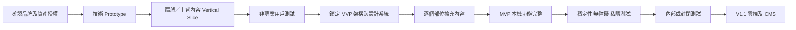

# Massage Flow — 專案說明與開工指南

| 文件欄位 | 內容 |
|---|---|
| 專案狀態 | **React Native Prototype 已可執行；已實作 MVP「智能流程編排 v1」及受控編輯的首批流程驗證** |
| Working title | Massage Flow |
| 版本 | 1.5 |
| 日期 | 2026-08-17 |
| 作者 | Manus AI |
| 主要讀者 | 產品負責人、UX／UI、3D／動畫、手機工程、後端工程、內容專家、QA |

## 1. 一句話介紹

**Massage Flow 係一款畀 18 歲或以上非專業用戶使用嘅手機 App。用戶透過互動 3D 人體揀選概括身體區域，再按對象、目標、優先度同時間，讓 MVP「智能流程編排 v1」自動細分肌群、手法與時段；用戶可在倒數前預覽／觀看示範，再以 3D 動畫、肌肉名稱、廣東話語音及逐段倒數完成流程。**

## 2. 目前做到邊度

本專案已建立可執行嘅 React Native Prototype，驗證本機家庭成員、自己按／幫人按分流、肩／上背／中背／下背概括選區、優先排序、左右側、感受及目標、決定性編排、預覽、示範、受控編輯與逐段倒數。Prototype 目前仍未接入 Unity、真實 3D 資產、語音、SQLite 持久儲存、後端、雲端或正式內容覆核。

| 已完成 | 未開始 |
|---|---|
| 產品定位、目標用戶及使用邊界 | 品牌、正式產品名稱及視覺設計 |
| 完整端到端按摩流程 | Unity 3D、正式動畫與語音內容 |
| 3D 選區、方案生成及引導決策 | 3D 人體／肌肉資產選購或製作 |
| 安全內容邊界及禁用技巧 | 專業內容製作及簽核 |
| 頁面架構、平台及離線方向 | React Native／Unity 正式 integration prototype |
| Backend storage、資料模型及 API 基線 | 雲端基礎設施及正式 CMS |
| MVP 邊界、指標及路線圖 | 程式開發、測試、上架或營運 |

## 3. 文件地圖

| 文件 | 用途 | 何時睇 |
|---|---|---|
| [`01_product_spec.md`](./01_product_spec.md) | 定義產品定位、用戶流程、功能要求、MVP、驗收準則、指標、風險同路線。 | 開產品會議、UX 設計、排優先度、寫 user story 或驗收時。 |
| [`02_technical_spec.md`](./02_technical_spec.md) | 定義 React Native／Unity／Backend 架構、儲存、schema、API、規則引擎、離線同步、安全同測試。 | 做技術 spike、估算、拆工程任務、設計 database／API 或 code review 時。 |
| [`03_project_overview.md`](./03_project_overview.md) | 專案入口、現況、開工次序、團隊分工、建議目錄同規格修改方法。 | 新成員加入、重啟專案或準備第一個 sprint 時。 |
| [`decision_log.md`](./decision_log.md) | 保存產品共創期間逐項確認嘅決定及演變。 | 想知道「點解當初會咁決定」時。 |
| [`safety_research.md`](./safety_research.md) | 整理按摩風險、禁按位置及產品安全含意嘅來源。 | 寫安全內容、聲明、動作庫或做專業覆核時。 |
| [`technical_research.md`](./technical_research.md) | 整理 Unity as a Library 同 React Native native integration 嘅官方限制。 | 技術 spike、揀 Unity 版本或設計 bridge lifecycle 時。 |

## 4. 已確認嘅核心產品決定

| 範疇 | 決定 |
|---|---|
| 用戶 | 18 歲或以上非專業成人；自己按，或者幫伴侶／成年家人按。 |
| 成員 | 可建立「我、伴侶、家人」等多個本機檔案；性別唔係必填。 |
| 入口 | 可旋轉、縮放嘅 3D 人體；用戶只揀概括區域及左右側，毋須先細選肌肉。 |
| 多部位 | 可選多個概括部位及左右側，由用戶排優先次序。 |
| 輸入 | 固定感受、程度、持續時間、目標，加可選文字／語音補充。 |
| 時間 | 5／10／15／20／30 分鐘快捷選項，加自訂及建議最短時間。 |
| 生成 | MVP「智能流程編排 v1」先按概括部位自動產生細分 `Program Segment`，用戶可預覽／觀看示範及作受控編輯；唔由空白開始。 |
| 模式可觸及性 | 自己按只提供可自行觸及的動作，難觸及位置只可使用已審核替代或不可選；幫人按保留完整已審核動作。 |
| Prototype 部位 | 目前可測試肩／上背、中背、下背；用戶可多選、調整優先次序及逐一設定左右側。 |
| Prototype 感受及目標 | 以 session-level 固定選項收集感受、程度、持續時間及目標；規則會調整暖身、收尾與保守度，並在預覽解釋原因。 |
| 執行 | 3D 高亮、細分肌群名稱、手部位置、方向動畫、力度、逐段倒數、下一步預告、文字及廣東話語音。 |
| 播放 | 自動倒數及推進，可暫停、重播、上一步、下一步或結束。 |
| 工具 | MVP 只支援徒手按摩。 |
| 安全 | 唔做個人健康篩查或強制阻擋；保留安全聲明、禁按區及永久禁止技巧。 |
| 結果 | 完成後保存紀錄，再揀「舒服咗／差唔多／更唔舒服」。 |
| 個人化 | 後續版本根據歷史作可解釋調整，可關閉及重設。 |
| 平台 | iOS／Android App；React Native 外殼 + Unity 全螢幕 3D 模組。 |
| 儲存 | SQLite 本機；PostgreSQL 結構資料；Object Storage／CDN 資產；Redis 暫態工作。 |
| 生成安全 | 規則引擎組合已審核動作；AI 唔可以創作手法或位置。 |
| 商業模式 | TBD；只預留 entitlement／subscription 擴充位。 |

## 5. MVP 定義

MVP 唔係純畫面 prototype，而係一個可以完成真正核心流程嘅**本機優先可用版本**。用戶應該可以建立成年家庭成員、揀自己按或幫人按、喺 3D 人體選擇概括部位、輸入目標同時間，讓系統自動編排細分 `Program Segment`、在倒數前預覽／觀看示範並作受控編輯，最後離線跟住 3D／語音逐段完成，再保存結果。

| MVP 內 | MVP 外 |
|---|---|
| 訪客及本機家庭檔案 | 必須登入、跨裝置同步 |
| 3D 概括選區及左右側 | 網頁版終端產品 |
| 智能流程編排 v1、程序預覽／示範及受控編輯 | AI 自由文字／語音理解 |
| 3D 動畫、繁中字幕、廣東話語音及逐段倒數 | 完整雲端內容審批後台 |
| 離線內容及方案播放 | 進階個人化 |
| 歷史紀錄及簡單結果評價 | 收費、訂閱、未成年人或專業模式 |

首批部位包括：**肩膊／上背、後頸安全區、下背兩側、前臂／手、臀髖外側、大腿、小腿同腳**。每個部位唔只係一個 3D 標籤，而係一個完整內容包：肌肉對應、左右側、自己按／幫人按動作、姿勢、時間、力度、動畫、廣東話語音、禁用條件、規則同專業覆核。

## 6. 建議開工次序

唔建議一開始建立完整 backend 或一次過製作全身內容。最高風險係 React Native 與 Unity 整合、3D 人體 hit-test、動畫表達、內容可跟隨程度同離線資產管線，因此應由 Prototype 先驗證。



### 6.1 Phase 0：開工前確認

| 任務 | 交付物 |
|---|---|
| 正式命名與品牌方向 | 名稱、logo brief、顏色、字體、語氣基線。 |
| 3D 資產方案 | 購買／委託／自製決定、授權證明、canonical mesh IDs。 |
| 內容專業責任 | 誰編寫、誰覆核、誰批准、安全用語同簽核紀錄。 |
| 技術版本 | React Native、Unity LTS、最低 iOS／Android、repo 及 CI 策略。 |
| 目標裝置 | 至少一部低階、一部中階及一部高階 iOS／Android 測試裝置。 |

### 6.2 Phase 1：Prototype

目前 Prototype 已用 React Native 驗證三類概括背部區域、模式可觸及性、優先排序、感受及目標、固定規則生成、預覽／示範及逐段倒數。下一個技術風險切片係接入 Unity、真實 3D 人體與動作資產、廣東話語音、SQLite 持久儲存及離線重播；呢啲仍然需要經內容覆核後先可以納入實際產品。

> Prototype 嘅成功唔係畫面靚，而係證明 **integration、3D 定位、內容表達、記憶體、資產下載同離線播放**可行。

### 6.3 Phase 2：MVP Foundation

Prototype 通過後先建立正式 design system、domain schema、content schema，並在同一個 MVP Foundation 依序完成：**MVP-A 編排基線**（概括區域到肌群、手法與時長的規則）、**MVP-B 預覽與示範**（segment 時間軸、縮圖／3D 示範入口及受控編輯）、**MVP-C 逐段執行**（讀取確認 segment 的倒數、下一步提示及紀錄）。其後再完成歷史、結果、analytics、資產回退，並以同一套 content contract 逐個加入首批身體區域。此序列屬 MVP 內部，不另加產品 roadmap phase。

### 6.4 Phase 3：V1.1 Cloud

MVP 核心穩定後先加入 OIDC、PostgreSQL、profile／session sync、備份恢復、資料匯出刪除、Object Storage／CDN 同正式內容管理後台。呢個次序可以避免 backend 先行，但核心 3D 體驗最後證明唔可用。

## 7. 建議第一批工作項目

| 優先 | Epic／工作項目 | 完成定義 |
|---|---|---|
| P0 | 3D 人體資產與授權 spike | 有可合法修改及散發嘅模型、肌肉 ID、皮膚層、骨架、polygon／texture 規格。 |
| P0 | React Native ↔ Unity integration spike | iOS／Android 都可多次進出全螢幕 Unity scene，狀態可雙向傳送，冇明顯 memory leak。 |
| P0 | Body Selector prototype | 肩／上背可旋轉、縮放、左右概括選區、肌肉提示層同禁按區顯示；不要求手動肌肉點選。 |
| P0 | Guidance animation prototype | 一個 `Program Segment` 有手部擺位、方向、力度、細分肌群名稱、階段倒數及廣東話語音。 |
| P0 | Content schema v0 | 定義 region、muscle、action、posture、constraint、asset、localization、release。 |
| P0 | Rule engine v0 | 同一組概括區域輸入產生固定 `Program Segment` 程序；支援 5／10／15 分鐘、自己按／幫人按、可觸及性 filter、已審核替代及可解釋原因。 |
| P1 | MVP-A Orchestration Core | 由概括區域、優先度與時長自動細分肌群、手法、姿勢及 segment 時間；產生可解釋 immutable snapshot。 |
| P1 | MVP-B Program Preview & Demo | 顯示 segment 時間軸、細分安排、縮圖／3D 示範入口及受控編輯；不重複計算流程。 |
| P1 | MVP-C Guided Countdown | Unity／音訊依確認 snapshot 逐段帶領，顯示本段、總餘時、下一步與完成事件。 |
| P0 | Offline asset pack prototype | Manifest、下載、checksum、atomic activate、飛行模式播放、回退。 |
| P1 | SQLite domain schema | Profile、draft、session、target、plan snapshot、outcome、outbox migration。 |
| P1 | Product flow wireframe | Onboarding 到完成頁全流程，包含 3D scene 邊界同錯誤狀態。 |
| P1 | 專業內容覆核流程 | 肩／上背動作、禁按區、語音稿同簽核紀錄完成。 |
| P1 | Usability test | 最少以非專業成人測試指出位置、理解方向、跟隨動作同姿勢轉換。 |
| P2 | MVP 其他部位內容包 | 每個部位符合相同 content completeness checklist。 |

## 8. 建議團隊角色

| 角色 | 主要責任 |
|---|---|
| Product／Project Owner | 維護 Product Spec、排優先度、決定未決事項、驗收核心流程。 |
| UX／UI Designer | 資訊架構、輸入流程、3D scene 前後介面、播放器、無障礙同 user testing。 |
| 3D Technical Artist | 人體／肌肉模型、mesh IDs、skin、rig、手部動畫、方向 path、LOD 同 asset optimization。 |
| Unity Engineer | Body Selector、Guidance Player、Addressables、shader、camera、hit-test、bridge 同 lifecycle。 |
| Mobile Engineer | React Native shell、SQLite、音訊、下載、導航、bridge host、offline 同 analytics。 |
| Backend Engineer | V1.1 API、PostgreSQL、sync、Object Storage、Redis、auth、內容發佈同 data lifecycle。 |
| Content／Anatomy Reviewer | 肌肉對應、動作、力度、姿勢、禁按區、用語及專業簽核。 |
| QA／Automation | Rule invariant、golden plan、Unity integration、離線、同步、無障礙同裝置矩陣。 |
| Privacy／Legal Reviewer | 安全聲明、私隱、資料 retention、醫療聲稱、資產及語音授權。 |

細團隊可以一人兼多職，但**內容專業覆核**同**程式實作**最好有角色分離，避免作者自行批准高風險內容。

## 9. 建議 repository 及目錄

以下係日後開始開發時嘅建議 monorepo 結構；目前未建立：

```text
massage-flow/
├── apps/
│   ├── mobile/                 # React Native App
│   ├── content-admin/          # Next.js CMS（V1.1）
│   └── api/                    # Backend API（V1.1）
├── unity/
│   ├── MassageFlow3D/          # Unity project
│   ├── exported/               # Generated iOS/Android library，不手改
│   └── tools/                  # Asset validation/export scripts
├── packages/
│   ├── domain/                 # IDs、enums、domain types
│   ├── content-schema/         # Content JSON Schema
│   ├── rule-engine/            # Deterministic plan generator
│   ├── bridge-protocol/        # RN ↔ Unity versioned messages
│   ├── localization/           # UI strings、content keys
│   └── analytics-schema/       # 去識別化 event contracts
├── content/
│   ├── anatomy/
│   ├── actions/
│   ├── localization/zh-HK/
│   ├── audio/zh-HK/
│   ├── manifests/
│   └── reviews/
├── infrastructure/             # V1.1 IaC、deploy、monitoring
├── docs/
│   ├── product/
│   ├── architecture/
│   ├── adr/
│   ├── api/
│   ├── content-guidelines/
│   ├── privacy/
│   └── test/
└── .github/workflows/          # CI/CD
```

Unity export、generated API client、asset manifest 同 build artifacts 要由自動流程生成，唔應由開發者手工修改。Domain ID、content schema、rule version 同 bridge protocol 應該各自有 owner 同 compatibility 規則。

## 10. 規格修改方法

日後修改需求時，唔應只喺聊天、issue 或程式碼改一個地方。建議使用以下 change workflow：

| 步驟 | 動作 |
|---|---|
| 1. 提出改動 | 清楚寫明問題、用戶影響、建議行為同是否影響已發佈內容。 |
| 2. 更新 Product Spec | 修改用戶流程、功能要求、MVP／路線、驗收準則同風險。 |
| 3. 建立或更新 ADR | 如果涉及平台、資料、同步、AI、內容或安全 invariant，就記錄選項同理由。 |
| 4. 更新 Technical Spec | 同步 schema、API、資料模型、錯誤、離線、監控同測試。 |
| 5. 更新內容 contract | 如影響肌肉、動作、動畫、語音或規則，升級 content schema／release。 |
| 6. 更新測試 | 增加 unit、golden、property、integration、content lint 或 usability case。 |
| 7. 標記版本 | 文件、API、bridge、rule 同 content 各自按影響升級版本。 |

每個重要改動最好用簡短 ADR 記錄：**背景、考慮選項、決定、理由、後果、回退方法**。已發佈方案及內容快照唔應因新決定而原地改寫。

## 11. Definition of Done

### 11.1 一個身體區域內容包完成

| 必須項 | 完成條件 |
|---|---|
| 解剖 | 區域、肌肉、左右側、表面地標同 mesh ID 完整。 |
| 動作 | 自己按／幫人按動作、姿勢、時間上下限、力度同替代動作完成。 |
| 視覺 | 肌肉高亮、手部擺位、方向動畫、相機視角、轉位圖完成。 |
| 語言 | 繁中名稱、步驟、字幕、廣東話語音稿及音訊完成。 |
| 安全 | 禁按區、禁止技巧、用語限制同停止提示完成。 |
| 規則 | 適用目標、優先度、時長、姿勢分組同 fallback 完成。 |
| 技術 | Asset pack、checksum、manifest、低階裝置測試同離線測試完成。 |
| 覆核 | 專業 reviewer 通過，有 revision、decision 同簽核紀錄。 |

### 11.2 一個 App 功能完成

功能必須有 Product Spec 對應要求、UX 狀態、domain／API contract、錯誤及離線行為、analytics、無障礙、單元／整合測試、實機驗證同文件更新。涉及 3D 或內容嘅功能，仲要通過 Unity asset 同 content version 測試。

## 12. 產品路線

| 階段 | 內容 |
|---|---|
| Prototype | 3D 旋轉、概括區域點選、單一部位固定示範程序、RN／Unity bridge、離線資產。 |
| MVP | 本機家庭檔案、首批概括部位、**智能流程編排 v1（MVP-A／B／C）**、程序預覽／示範、受控編輯、3D＋廣東話逐段引導、歷史同結果。 |
| V1.1 | 登入、雲端同步、備份／恢復、PostgreSQL、Object Storage／CDN、正式 CMS。 |
| V1.2 | AI 文字／語音理解、可解釋個人化、進階內容工具。 |
| V1.3 | 簡中／英文、多語音、更多部位同皮膚外觀。 |
| V2 | 按摩工具、網頁版及其他進階模式；專業模式另行研究。 |

## 13. 目前未決事項

| 未決事項 | 建議決定時間 |
|---|---|
| 正式產品名、品牌同視覺方向 | UX prototype 前 |
| 3D 解剖模型來源及授權 | 技術 Prototype 前 |
| 內容專業 reviewer 及責任 | 第一個動作製作前 |
| Unity LTS、最低 OS、裝置規格 | Prototype 開始時，完成後鎖定 |
| 廣東話真人錄音或 TTS | 第一個 guidance 測試後 |
| 商業模式 | MVP user testing 後，V1.1 規劃前 |
| 雲端供應商及資料地區 | V1.1 開工前 |
| 首次公開平台次序 | MVP 穩定性數據出現後 |

## 14. 開工時第一個決定

如果日後正式重啟本專案，第一個會議唔應該討論全部功能，而係只決定以下三件事：

| 問題 | 原因 |
|---|---|
| 邊一套 3D 人體／肌肉資產可以合法使用及修改？ | 冇穩定模型同 canonical IDs，選區、動畫、規則同內容全部無法落地。 |
| 邊位專業人士負責第一個肩／上背內容包嘅覆核？ | 核心價值唔只係 3D，而係可信、可跟隨嘅動作內容。 |
| Prototype 用邊組 React Native、Unity LTS、iOS／Android 裝置？ | Unity 嵌入、全螢幕、記憶體同 build pipeline 係最高技術風險。 |

完成以上三個決定後，再按 `02_technical_spec.md` 嘅 Prototype 驗證清單建立第一個 vertical slice。

## 15. 參考資料

按摩安全及產品限制嘅來源已整理喺 [`safety_research.md`](./safety_research.md)；Unity as a Library 及 React Native native integration 官方資料已整理喺 [`technical_research.md`](./technical_research.md)。正式對外發佈前，仍需由目標市場嘅專業、私隱及法律人員重新審核。
