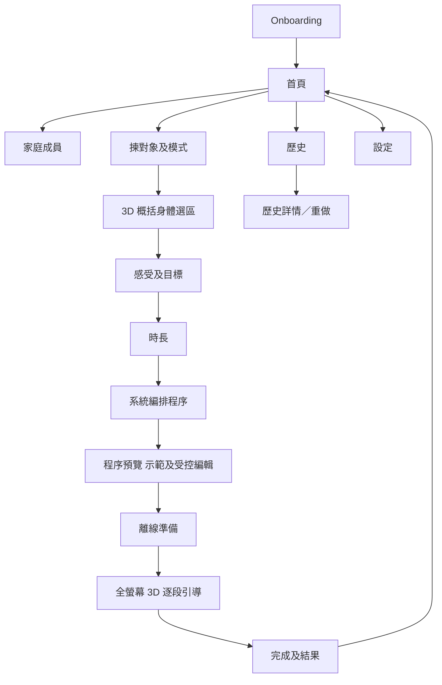

# Massage Flow — UI Flow Reference

| 文件欄位 | 內容 |
|---|---|
| 狀態 | 規格參考，唔係最終視覺設計；已同步 MVP「智能流程編排 v1」、模式可觸及性、多部位、感受目標及受控編輯 Prototype |
| 版本 | 1.5 |
| 日期 | 2026-08-17 |
| 對應文件 | `01_product_spec.md` v1.5、`02_technical_spec.md` v1.5 |

> **v1.5 互動規則：** 程序預覽提供「調整程序」入口；調整頁只顯示已准許的排序、主要時長及較柔和替代選項。按「更新程序預覽」後，預覽須顯示已套用調整，並由該份更新後程序進入示範與倒數。

## 1. 導航結構

MVP 採用底部主導航，建議只有「首頁」、「歷史」同「設定」。建立方案係由首頁進入嘅 task flow，執行播放器係全螢幕 modal／scene，唔顯示底部導航，避免分心。



## 2. Screen inventory

| ID | 頁面 | 主要目的 | 主要離開方式 |
|---|---|---|---|
| ONB-01 | 歡迎及定位 | 解釋產品用途同非醫療定位。 | 下一步 |
| ONB-02 | 完整安全聲明 | 首次確認安全邊界。 | 接受並繼續／離開 |
| ONB-03 | 訪客或登入 | MVP 以訪客開始；V1.1 可登入。 | 訪客開始／登入 |
| ONB-04 | 語言及核心內容 | 選繁中／廣東話，下載核心資產。 | 完成 |
| HOME-01 | 首頁 | 揀成員、開始方案、重做上次、睇歷史。 | 各功能入口 |
| PROF-01 | 家庭成員列表 | 新增、修改、停用成年成員。 | 返回／揀成員 |
| PROF-02 | 成員編輯 | 暱稱、年齡段、成人確認、預設模式、力度。 | 保存／取消 |
| FLOW-01 | 對象及模式 | 確認今次為邊個按、自己按或幫人按。 | 下一步 |
| FLOW-02 | 3D 概括選區 | 上背、中背、下背等概括區域、左右側、多選、優先排序；不要求手動點選肌肉。 | 下一步／返回 |
| FLOW-03 | 感受及目標 | 為各 target 選感受、程度、持續時間、目標。 | 下一步／返回 |
| FLOW-04 | 時長 | 快捷／自訂、建議最短時間、時間不足提示。 | 生成／返回 |
| PLAN-01 | 程序編排中 | 顯示系統正在根據概括部位、時間與優先度細分肌群、手法及時段；可取消。 | 自動到預覽／取消 |
| PLAN-02 | 程序預覽及示範 | 姿勢分組、總時間、segment 卡、系統細分肌群、示範縮圖／3D 預覽入口、簡短安全提醒。 | 開始／編輯／返回 |
| PLAN-03 | 受控編輯 | 概括部位次序、segment 時間、力度、替代手法、重新編排與重新計時。 | 儲存修改／取消 |
| OFF-01 | 離線準備 | 顯示資產完整性、下載大小、空間及進度。 | 開始／稍後 |
| PLAY-01 | 3D 引導播放器 | 高亮位置、肌肉名、動作、語音、倒數。 | 暫停／結束／完成 |
| PLAY-02 | 姿勢轉換 | 顯示下一個姿勢、擺位圖同確認。 | 我準備好 |
| DONE-01 | 完成摘要 | 實際時間、完成步驟、結果評價、保存。 | 完成 |
| HIST-01 | 歷史列表 | 按成員、部位、日期瀏覽。 | 開詳情 |
| HIST-02 | 歷史詳情 | 睇舊 plan snapshot、結果、重做。 | 重做／返回 |
| SET-01 | 設定首頁 | 離線內容、語言、個人化、私隱、安全。 | 子頁／返回 |
| SET-02 | 離線內容 | 下載、更新、回退、刪除內容包。 | 管理／返回 |

## 3. 核心畫面要求

### 3.1 首頁 HOME-01

```text
┌──────────────────────────┐
│ Massage Flow        設定 │
│                          │
│ 今次為邊個按摩？          │
│ [ 我 ▼ ]                  │
│                          │
│ [ 開始新按摩 ]             │
│                          │
│ 上次方案                   │
│ 肩膊／上背 · 10 分鐘       │
│ [ 再做一次 ]               │
│                          │
│ 最近紀錄                   │
│ 伴侶 · 小腿 · 舒服咗       │
└──────────────────────────┘
```

首頁主操作只保留一個明顯 CTA「開始新按摩」。如果未有成員，先建立「我」；如果上次方案依賴已刪內容，重做前要重新驗證或生成替代版本。

### 3.2 3D 選區 FLOW-02

```text
┌──────────────────────────┐
│ ‹ 選擇部位          2/4  │
│ [表面] [肌肉提示] [重設視角]│
│                          │
│         3D 人體           │
│   旋轉 · 縮放 · 點選      │
│                          │
│ 已選                       │
│ 1  左肩／上背      [≡] [×]│
│ 2  右小腿          [≡] [×]│
│                          │
│ [ 下一步 ]                 │
└──────────────────────────┘
```

禁按區唔可以只用紅色；要使用斜紋、鎖形或「不可選」標籤。點選區域後，bottom sheet 可以顯示相關肌群及通俗名稱作提示，但 MVP 不要求用戶細選；真正嘅肌群與手法細分由編排引擎在時長選擇後完成。多部位排序要支援拖拉，同時提供無障礙「向上／向下」按鈕。

Prototype 將 FLOW-02 分成「選概括部位」及「逐一確認每個部位左右側」兩個畫面：先選肩／上背、中背、下背，再以清單上／下按鈕改變優先次序；選完後按順序逐一選左、右或雙側。預覽頁顯示所有已選部位與 segment 的來源區域，讓用戶在開始倒數前確認系統沒有調換部位次序。

FLOW-01 已選「自己按」時，FLOW-02 只顯示 `DIRECT` 概括區域；`SUBSTITUTE_ONLY` 以非紅色的「較難自行接觸」狀態呈現，點擊後需先顯示可行替代方向及「使用替代流程」確認；`UNAVAILABLE` 不可點選並提供簡短原因。已選「幫人按」時，FLOW-02 顯示完整已審核區域，並以按摩者視角顯示接受按摩者的相對方向。PLAN-02 的替代 segment 卡必須標示「系統為自己按改用替代動作」，讓預覽、示範及倒數有同一解釋。

### 3.3 感受及目標 FLOW-03

每個 target 用一張 accordion card，避免一次顯示過多欄位。完成一張後顯示摘要，例如「左肩／上背：繃緊 3／5，幾日，放鬆」。補充文字喺 MVP 要標明「只作紀錄，唔影響今次方案」；V1.2 啟用 AI 後先改成「系統會嘗試理解，生成前請確認標籤」。

現行 Prototype 先使用一張 session-level FLOW-03 表單，放喺所有部位左右側設定後、總時長前。表單以大按鈕收集主要感受、1–5 程度、持續時間及今次目標；程度較高時即時顯示「會以較保守節奏安排」提示。下一頁時長頁與預覽頁必須顯示系統如何使用這組選擇，而唔可以只收集後隱藏。

### 3.4 程序預覽及示範 PLAN-02

```text
┌──────────────────────────┐
│ ‹ 你嘅按摩程序      編輯  │
│ 15 分鐘 · 2 個姿勢        │
│ 系統已按你所選部位細分安排 │
│ [觀看示範] 本方案供一般放鬆 │
│                          │
│ 坐姿 · 7 分鐘              │
│ 1 熱身肩背          1:00  │
│ 2 左上斜方肌        3:00  │
│ 3 右上斜方肌        3:00  │
│                          │
│ 俯臥 · 8 分鐘              │
│ 4 上背兩側          6:30  │
│ 5 放鬆收尾          1:30  │
│                          │
│ [ 下載並開始 ]             │
└──────────────────────────┘
```

每張 `Program Segment` 卡可以預覽 3D 縮圖，並清楚標示「你揀嘅概括部位」與「系統安排嘅細分肌群、手法及時長」。用戶可點擊「觀看示範」觀看整套流程或指定 segment；MVP 唔應喺 React Native 卡片內嵌即時 Unity view，縮圖係預先產生圖片，真正 3D 示範要進入全螢幕 Unity scene。示範結束或關閉後必須返回同一份已確認程序，不可重新生成或改變倒數內容。

### 3.5 播放器 PLAY-01

```text
┌──────────────────────────┐
│ ×  第 2 / 5 段     總餘 06:42│
│                          │
│         3D 人體           │
│  肌肉高亮 + 手部動畫       │
│                          │
│ 上斜方肌 · 左側             │
│ 指腹慢慢向外揉動            │
│ 力度：輕至中等              │
│ 本段餘 02:18 · 下一步：右上背 │
│                          │
│ [上一步] [暫停] [重播] [下一步]│
└──────────────────────────┘
```

播放器主要控制保持固定位置，避免用戶每個 segment 重新尋找。螢幕點擊可以短暫顯示／隱藏控制，但目前細分肌群、本段倒數、總剩餘時間、下一步預告、字幕及結束入口必須可隨時重新顯示。結束需要二次確認，但唔可以阻止緊急離開。

### 3.6 姿勢轉換 PLAY-02

姿勢轉換唔計入主要動作倒數。畫面顯示新姿勢、按摩者位置、接受按摩者方向、簡單擺位圖同「我準備好」；語音播完後唔自動開始，等用戶明確確認。

### 3.7 完成 DONE-01

完成摘要避免醫療效果用語，只問「完成後整體感覺？」並提供「舒服咗／差唔多／更唔舒服」。如選「更唔舒服」，只提供一般停止使用及按需要尋求合適專業協助嘅提示，唔嘗試診斷原因。

## 4. 必須設計嘅狀態

| 狀態 | 必須有嘅處理 |
|---|---|
| 空白 | 未有家庭成員、未有歷史、未下載內容。 |
| Loading | 生成方案、啟動 Unity、取得 manifest、載入音訊。 |
| 離線 | 顯示仍可使用嘅內容；雲端功能標示稍後同步。 |
| 時間不足 | 解釋會集中高優先部位，提供增加時間或減少部位。 |
| 內容缺失 | 顯示下載大小、空間要求、重新下載或重新生成。 |
| Unity 失敗 | 重試一次、返回預覽、顯示 diagnostic ID。 |
| 被中斷 | 電話、App 背景、音訊焦點失去時自動暫停。 |
| 低電量／發熱 | 建議降低畫質或關閉螢幕常亮，但保留語音。 |
| 無障礙 | 字體放大、螢幕閱讀器、減少動態、非顏色提示。 |

## 5. UX 文案原則

介面使用簡單、直接、非醫療化嘅廣東話書面語。肌肉第一次出現時同時顯示通俗位置，例如「上斜方肌（肩膊近頸位置）」。避免使用「治療、診斷、復位、矯正、治癒、保證有效」等字眼；使用「一般放鬆、舒緩感、活動感、個人主觀感受」。

## 6. Prototype 最少畫面

Prototype 需要 ONB-02、HOME-01、FLOW-01、FLOW-02、FLOW-03、FLOW-04、PLAN-02、PLAY-01、DONE-01 九個最少畫面。首批背部內容包要驗證「概括選區 → 左右側 → 感受及目標 → 固定規則編排 → 程序預覽／示範 → 逐段倒數」；FLOW-03 必須在時長頁與預覽留下可理解嘅編排原因。
